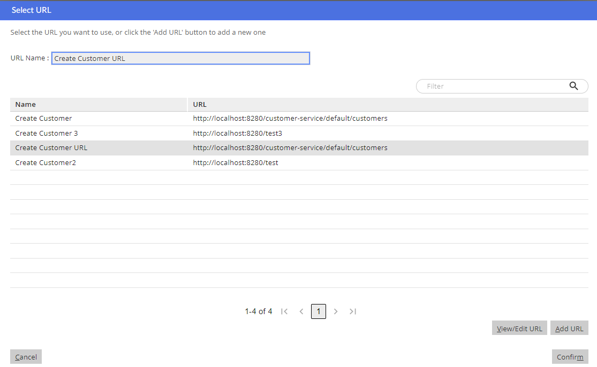
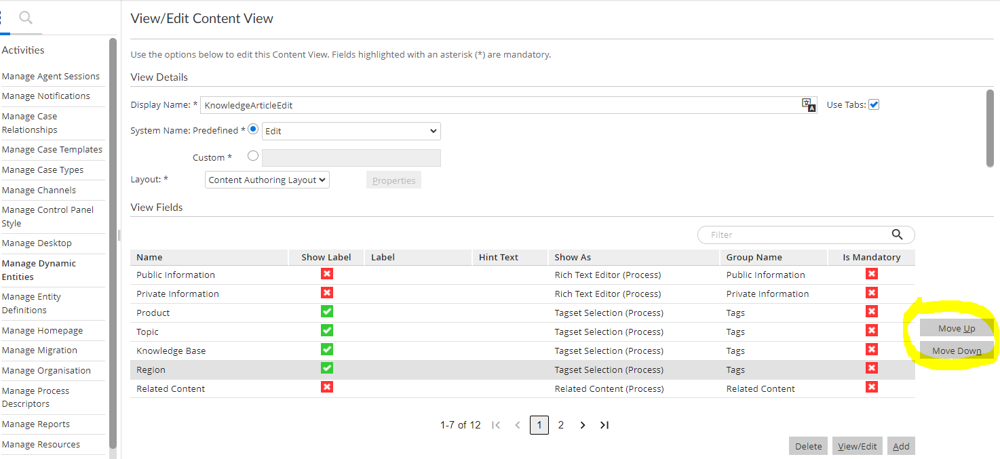
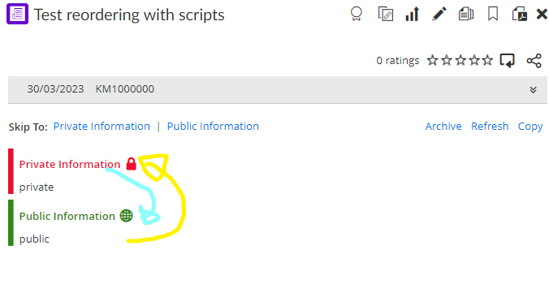
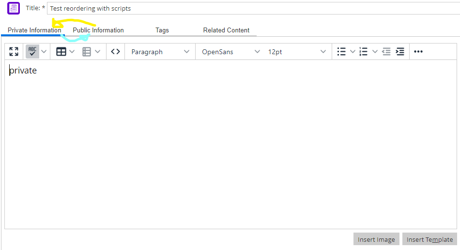

SQLTask Library
===============

This  library has currently a total of 169 templates, divided in 103 sections; 4 [Activity](#activity), 1 [Pers demo](#pers-demo), 6 [Perspective](#perspective), 9 [Agent](#agent), 1 [Queue](#queue), 1 [All Background Verbs](#all-background-verbs), 1 [Another profile](#another-profile), 1 [Association Type](#association-type), 3 [Background Verb](#background-verb), 10 [Profile](#profile), 1 [Basic Entity Definition](#basic-entity-definition), 1 [Category](#category), 1 [Content Field Index Mapping](#content-field-index-mapping), 1 [Content Type](#content-type), 1 [Dynamic Content Verb](#dynamic-content-verb), 1 [Dynamic Entity](#dynamic-entity), 1 [Dynamic Entity Def](#dynamic-entity-def), 1 [Dynamic Entity String Field](#dynamic-entity-string-field), 1 [Dynamic Entity Tagset Field](#dynamic-entity-tagset-field), 1 [Dynamic Entity View](#dynamic-entity-view), 1 [Dynamic Entity View Field](#dynamic-entity-view-field), 10 [Entitlement](#entitlement), 1 [Dynamic entity field](#dynamic-entity-field), 4 [Team](#team), 7 [Verb](#verb), 3 [Entity Definition](#entity-definition), 1 [Feedback Notification Type](#feedback-notification-type), 2 [Localised Field](#localised-field), 2 [Menu Item](#menu-item), 1 [Migration Domain](#migration-domain), 1 [Process Descriptor](#process-descriptor), 2 [Reason Code](#reason-code), 1 [Report](#report), 1 [Static Menu](#static-menu), 2 [Tab](#tab), 2 [Ad right panel](#ad-right-panel), 1 [Tag](#tag), 1 [Team Position](#team-position), 2 [Team Role](#team-role), 2 [Team Role Type](#team-role-type), 3 [Url](#url), 3 [Entity](#entity), 2 [View Contact Tab](#view-contact-tab), 1 [Web Integration Host](#web-integration-host), 1 [Max Count Work Area](#max-count-work-area), 1 [New Content Type](#new-content-type), 1 [Customer](#customer), 2 [Channel State Manager Listener](#channel-state-manager-listener), 1 [Base Entity](#base-entity), 1 [Process Desc Ref](#process-desc-ref), 1 [All agents](#all-agents), 1 [Tagset And All Tags](#tagset-and-all-tags), 1 [Dynamic View Field](#dynamic-view-field), 0 [Dynamic View Field1](#dynamic-view-field1), 0 [Dynamic View Field2](#dynamic-view-field2), 0 [Dynamic View Field3](#dynamic-view-field3), 1 [Entity Default Instance Verb](#entity-default-instance-verb), 1 [Agent Password](#agent-password), 1 [Ccadmin Version](#ccadmin-version), 1 [Profile Perspective Seq No](#profile-perspective-seq-no), 1 [Verb Path](#verb-path), 1 [Verb Process Descriptor Reference](#verb-process-descriptor-reference), 1 [Verb User Visible Flag](#verb-user-visible-flag), 1 [Dynamic Entity Field](#dynamic-entity-field), 1 [Dynamic String Field Property](#dynamic-string-field-property), 1 [Dynamic Tagset Field Property](#dynamic-tagset-field-property), 1 [Entity Entitlement](#entity-entitlement), 1 [Process Descriptor Ref](#process-descriptor-ref), 1 [Add Entity Def](#add-entity-def), 1 [Set Update Values](#set-update-values), 1 [Context Verb Entry](#context-verb-entry), 2 [Dynamic Verb List](#dynamic-verb-list), 1 [Dynamic Verb Parameter](#dynamic-verb-parameter), 1 [Idmap](#idmap), 6 , 1 [Agent Synchronizer Default Mapping](#agent-synchronizer-default-mapping), 1 [Agent Synchronizer Mapping](#agent-synchronizer-mapping), 3 [Tenant Property](#tenant-property), 1 [Tps Property](#tps-property), 1 [And String Functions Tutorial](#and-string-functions-tutorial), 1 [Add content type](#add-content-type), 1 [Db](#db), 1 [And Prompts](#and-prompts), 1 [Ad Right Panel Tabs Verbs](#ad-right-panel-tabs-verbs), 1 [Agent Profile Background Vebs](#agent-profile-background-vebs), 1 [Channel State Manager Listeners](#channel-state-manager-listeners), 1 [Entitlements By System Name](#entitlements-by-system-name), 1 [Entity Displayed Verbs](#entity-displayed-verbs), 1 [Entity Verbs](#entity-verbs), 1 [Entity Verbs Keynames](#entity-verbs-keynames), 1 [Entitydef By Keyname](#entitydef-by-keyname), 1 [Keynames](#keynames), 1 [Keynames By Id](#keynames-by-id), 1 [Process Descriptor Ref By Repo Path](#process-descriptor-ref-by-repo-path), 1 [Process Descriptor Reference](#process-descriptor-reference), 2 [Repo path](#repo-path), 1 [Profile Entitlements](#profile-entitlements), 1 [Profile Verbs](#profile-verbs), 1 [User Profiles](#user-profiles), 1 [Verb By Keyname](#verb-by-keyname), 1 [Verb Entitlements](#verb-entitlements), 1 [Verbs](#verbs), 1 [Table Name](#table-name)

Tables of Contents
==================

* [Activity](#activity)
	* [Add Activity To Pers Demo](#add-activity-to-pers-demo)
	* [Add Activity To Perspective](#add-activity-to-perspective)
	* [Add Activity To Perspective With Seq No](#add-activity-to-perspective-with-seq-no)
	* [Remove Activity From Perspective](#remove-activity-from-perspective)
* [Pers demo](#pers-demo)
	* [Add Activity To Pers Demo](#add-activity-to-pers-demo)
* [Perspective](#perspective)
	* [Add Activity To Perspective](#add-activity-to-perspective)
	* [Add Activity To Perspective With Seq No](#add-activity-to-perspective-with-seq-no)
	* [Add Perspective](#add-perspective)
	* [Add Perspective To Profile](#add-perspective-to-profile)
	* [Remove Activity From Perspective](#remove-activity-from-perspective)
	* [Remove Perspective From Profile](#remove-perspective-from-profile)
* [Agent](#agent)
	* [Add Agent For Commit](#add-agent-for-commit)
	* [Add Agent For Dev](#add-agent-for-dev)
	* [Add Agent To Queue](#add-agent-to-queue)
	* [Add Entitlement To Agent](#add-entitlement-to-agent)
	* [Add Profile To Agent](#add-profile-to-agent)
	* [Remove Agent For Dev](#remove-agent-for-dev)
	* [Remove Entitlement From Agent](#remove-entitlement-from-agent)
	* [Remove Profile From Agent](#remove-profile-from-agent)
	* [View Agent](#view-agent)
* [Queue](#queue)
	* [Add Agent To Queue](#add-agent-to-queue)
* [All Background Verbs](#all-background-verbs)
	* [Add All Background Verbs From Another Profile](#add-all-background-verbs-from-another-profile)
* [Another profile](#another-profile)
	* [Add All Background Verbs From Another Profile](#add-all-background-verbs-from-another-profile)
* [Association Type](#association-type)
	* [Add Association Type](#add-association-type)
* [Background Verb](#background-verb)
	* [Add Background Verb](#add-background-verb)
	* [Add Background Verb To Profile](#add-background-verb-to-profile)
	* [Remove Background Verb From Profile](#remove-background-verb-from-profile)
* [Profile](#profile)
	* [Add Background Verb To Profile](#add-background-verb-to-profile)
	* [Add Entitlement To Profile](#add-entitlement-to-profile)
	* [Add Perspective To Profile](#add-perspective-to-profile)
	* [Add Profile](#add-profile)
	* [Add Profile To Agent](#add-profile-to-agent)
	* [Remove Background Verb From Profile](#remove-background-verb-from-profile)
	* [Remove Entitlement From Profile](#remove-entitlement-from-profile)
	* [Remove Perspective From Profile](#remove-perspective-from-profile)
	* [Remove Profile From Agent](#remove-profile-from-agent)
	* [Remove Profile From All Agents](#remove-profile-from-all-agents)
* [Basic Entity Definition](#basic-entity-definition)
	* [Add Basic Entity Definition](#add-basic-entity-definition)
* [Category](#category)
	* [Add Category](#add-category)
* [Content Field Index Mapping](#content-field-index-mapping)
	* [Add Content Field Index Mapping](#add-content-field-index-mapping)
* [Content Type](#content-type)
	* [Add Content Type](#add-content-type)
* [Dynamic Content Verb](#dynamic-content-verb)
	* [Add Dynamic Content Verb](#add-dynamic-content-verb)
* [Dynamic Entity](#dynamic-entity)
	* [Add Dynamic Entity](#add-dynamic-entity)
* [Dynamic Entity Def](#dynamic-entity-def)
	* [Add Dynamic Entity Def](#add-dynamic-entity-def)
* [Dynamic Entity String Field](#dynamic-entity-string-field)
	* [Add Dynamic Entity String Field](#add-dynamic-entity-string-field)
* [Dynamic Entity Tagset Field](#dynamic-entity-tagset-field)
	* [Add Dynamic Entity Tagset Field](#add-dynamic-entity-tagset-field)
* [Dynamic Entity View](#dynamic-entity-view)
	* [Add Dynamic Entity View](#add-dynamic-entity-view)
* [Dynamic Entity View Field](#dynamic-entity-view-field)
	* [Add Dynamic Entity View Field](#add-dynamic-entity-view-field)
* [Entitlement](#entitlement)
	* [Add Entitlement](#add-entitlement)
	* [Add Entitlement To Agent](#add-entitlement-to-agent)
	* [Add Entitlement To Dynamic Entity Field](#add-entitlement-to-dynamic-entity-field)
	* [Add Entitlement To Profile](#add-entitlement-to-profile)
	* [Add Entitlement To Team](#add-entitlement-to-team)
	* [Add Entitlement To Verb](#add-entitlement-to-verb)
	* [Remove Entitlement From Agent](#remove-entitlement-from-agent)
	* [Remove Entitlement From Profile](#remove-entitlement-from-profile)
	* [Remove Entitlement From Team](#remove-entitlement-from-team)
	* [Remove Entitlement From Verb](#remove-entitlement-from-verb)
* [Dynamic entity field](#dynamic-entity-field)
	* [Add Entitlement To Dynamic Entity Field](#add-entitlement-to-dynamic-entity-field)
* [Team](#team)
	* [Add Entitlement To Team](#add-entitlement-to-team)
	* [Add Team](#add-team)
	* [Remove Entitlement From Team](#remove-entitlement-from-team)
	* [Remove Team](#remove-team)
* [Verb](#verb)
	* [Add Entitlement To Verb](#add-entitlement-to-verb)
	* [Add Verb To Entity](#add-verb-to-entity)
	* [Add Verb With Existing Pdr](#add-verb-with-existing-pdr)
	* [Extend Verb](#extend-verb)
	* [Extend Verb With Config](#extend-verb-with-config)
	* [Remove Entitlement From Verb](#remove-entitlement-from-verb)
	* [Remove Verb From Entity](#remove-verb-from-entity)
* [Entity Definition](#entity-definition)
	* [Add Entity Definition](#add-entity-definition)
	* [Remove Entity Definition](#remove-entity-definition)
	* [View Entity Definition](#view-entity-definition)
* [Feedback Notification Type](#feedback-notification-type)
	* [Add Feedback Notification Type](#add-feedback-notification-type)
* [Localised Field](#localised-field)
	* [Add Localised Field](#add-localised-field)
	* [Update Localised Field](#update-localised-field)
* [Menu Item](#menu-item)
	* [Add Menu Item](#add-menu-item)
	* [Remove Menu Item](#remove-menu-item)
* [Migration Domain](#migration-domain)
	* [Add Migration Domain](#add-migration-domain)
* [Process Descriptor](#process-descriptor)
	* [Add Process Descriptor](#add-process-descriptor)
* [Reason Code](#reason-code)
	* [Add Reason Code](#add-reason-code)
	* [Remove Reason Code](#remove-reason-code)
* [Report](#report)
	* [Add Report](#add-report)
* [Static Menu](#static-menu)
	* [Add Static Menu](#add-static-menu)
* [Tab](#tab)
	* [Add Tab To Ad Right Panel](#add-tab-to-ad-right-panel)
	* [Remove Tab From Ad Right Panel](#remove-tab-from-ad-right-panel)
* [Ad right panel](#ad-right-panel)
	* [Add Tab To Ad Right Panel](#add-tab-to-ad-right-panel)
	* [Remove Tab From Ad Right Panel](#remove-tab-from-ad-right-panel)
* [Tag](#tag)
	* [Add Tag](#add-tag)
* [Team Position](#team-position)
	* [Add Team Position](#add-team-position)
* [Team Role](#team-role)
	* [Add Team Role](#add-team-role)
	* [Remove Team Role](#remove-team-role)
* [Team Role Type](#team-role-type)
	* [Add Team Role Type](#add-team-role-type)
	* [Remove Team Role Type](#remove-team-role-type)
* [Url](#url)
	* [Add Url With Smartmatch Purpose](#add-url-with-smartmatch-purpose)
	* [Add Url With Smartmatch Purpose Rollback](#add-url-with-smartmatch-purpose-rollback)
	* [Update Url With Smartmatch Purpose](#update-url-with-smartmatch-purpose)
* [Entity](#entity)
	* [Add Verb To Entity](#add-verb-to-entity)
	* [Extend Entity](#extend-entity)
	* [Remove Verb From Entity](#remove-verb-from-entity)
* [View Contact Tab](#view-contact-tab)
	* [Add View Contact Tab](#add-view-contact-tab)
	* [Remove View Contact Tab](#remove-view-contact-tab)
* [Web Integration Host](#web-integration-host)
	* [Add Web Integration Host](#add-web-integration-host)
* [Max Count Work Area](#max-count-work-area)
	* [Change Max Count Work Area](#change-max-count-work-area)
* [New Content Type](#new-content-type)
	* [Config New Content Type](#config-new-content-type)
* [Customer](#customer)
	* [Extend Customer](#extend-customer)
* [Channel State Manager Listener](#channel-state-manager-listener)
	* [Register Channel State Manager Listener](#register-channel-state-manager-listener)
	* [Unregister Channel State Manager Listener](#unregister-channel-state-manager-listener)
* [Base Entity](#base-entity)
	* [Remove Base Entity](#remove-base-entity)
* [Process Desc Ref](#process-desc-ref)
	* [Remove Process Desc Ref](#remove-process-desc-ref)
* [All agents](#all-agents)
	* [Remove Profile From All Agents](#remove-profile-from-all-agents)
* [Tagset And All Tags](#tagset-and-all-tags)
	* [Remove Tagset And All Tags](#remove-tagset-and-all-tags)
* [Dynamic View Field](#dynamic-view-field)
	* [Reorder Dynamic View Field](#reorder-dynamic-view-field)
* [Dynamic View Field1](#dynamic-view-field1)
* [Dynamic View Field2](#dynamic-view-field2)
* [Dynamic View Field3](#dynamic-view-field3)
* [Entity Default Instance Verb](#entity-default-instance-verb)
	* [Set Entity Default Instance Verb](#set-entity-default-instance-verb)
* [Agent Password](#agent-password)
	* [Update Agent Password](#update-agent-password)
* [Ccadmin Version](#ccadmin-version)
	* [Update Ccadmin Version](#update-ccadmin-version)
* [Profile Perspective Seq No](#profile-perspective-seq-no)
	* [Update Profile Perspective Seq No](#update-profile-perspective-seq-no)
* [Verb Path](#verb-path)
	* [Update Verb Path](#update-verb-path)
* [Verb Process Descriptor Reference](#verb-process-descriptor-reference)
	* [Update Verb Process Descriptor Reference](#update-verb-process-descriptor-reference)
* [Verb User Visible Flag](#verb-user-visible-flag)
	* [Update Verb User Visible Flag](#update-verb-user-visible-flag)
* [Dynamic Entity Field](#dynamic-entity-field)
	* [Add Dynamic Entity Field Without Specific Props](#add-dynamic-entity-field-without-specific-props)
* [Dynamic String Field Property](#dynamic-string-field-property)
	* [Add Dynamic String Field Property](#add-dynamic-string-field-property)
* [Dynamic Tagset Field Property](#dynamic-tagset-field-property)
	* [Add Dynamic Tagset Field Property](#add-dynamic-tagset-field-property)
* [Entity Entitlement](#entity-entitlement)
	* [Add Entity Entitlement](#add-entity-entitlement)
* [Process Descriptor Ref](#process-descriptor-ref)
	* [Add Process Descriptor Ref](#add-process-descriptor-ref)
* [Add Entity Def](#add-entity-def)
	* [Base Add Entity Def](#base-add-entity-def)
* [Set Update Values](#set-update-values)
	* [Generic Set Update Values](#generic-set-update-values)
* [Context Verb Entry](#context-verb-entry)
	* [Insert Context Verb Entry](#insert-context-verb-entry)
* [Dynamic Verb List](#dynamic-verb-list)
	* [Insert Dynamic Verb List](#insert-dynamic-verb-list)
	* [Remove Dynamic Verb List](#remove-dynamic-verb-list)
* [Dynamic Verb Parameter](#dynamic-verb-parameter)
	* [Insert Dynamic Verb Parameter](#insert-dynamic-verb-parameter)
* [Idmap](#idmap)
	* [Remove Idmap](#remove-idmap)
* 
	* [Test](#test)
	* [Test](#test)
	* [Filters](#filters)
	* [How To Add Content Type](#how-to-add-content-type)
	* [Include](#include)
	* [Keynames](#keynames)
* [Agent Synchronizer Default Mapping](#agent-synchronizer-default-mapping)
	* [Add Agent Synchronizer Default Mapping](#add-agent-synchronizer-default-mapping)
* [Agent Synchronizer Mapping](#agent-synchronizer-mapping)
	* [Add Agent Synchronizer Mapping](#add-agent-synchronizer-mapping)
* [Tenant Property](#tenant-property)
	* [Add Tenant Property](#add-tenant-property)
	* [Remove Tenant Property](#remove-tenant-property)
	* [Update Tenant Property](#update-tenant-property)
* [Tps Property](#tps-property)
	* [View Tps Property](#view-tps-property)
* [And String Functions Tutorial](#and-string-functions-tutorial)
	* [Globals And String Functions Tutorial](#globals-and-string-functions-tutorial)
* [Add content type](#add-content-type)
	* [How To Add Content Type](#how-to-add-content-type)
* [Db](#db)
	* [Querying Db](#querying-db)
* [And Prompts](#and-prompts)
	* [Variable And Prompts](#variable-and-prompts)
* [Ad Right Panel Tabs Verbs](#ad-right-panel-tabs-verbs)
	* [View Ad Right Panel Tabs Verbs](#view-ad-right-panel-tabs-verbs)
* [Agent Profile Background Vebs](#agent-profile-background-vebs)
	* [View Agent Profile Background Vebs](#view-agent-profile-background-vebs)
* [Channel State Manager Listeners](#channel-state-manager-listeners)
	* [View Channel State Manager Listeners](#view-channel-state-manager-listeners)
* [Entitlements By System Name](#entitlements-by-system-name)
	* [View Entitlements By System Name](#view-entitlements-by-system-name)
* [Entity Displayed Verbs](#entity-displayed-verbs)
	* [View Entity Displayed Verbs](#view-entity-displayed-verbs)
* [Entity Verbs](#entity-verbs)
	* [View Entity Verbs](#view-entity-verbs)
* [Entity Verbs Keynames](#entity-verbs-keynames)
	* [View Entity Verbs Keynames](#view-entity-verbs-keynames)
* [Entitydef By Keyname](#entitydef-by-keyname)
	* [View Entitydef By Keyname](#view-entitydef-by-keyname)
* [Keynames](#keynames)
	* [View Keynames](#view-keynames)
* [Keynames By Id](#keynames-by-id)
	* [View Keynames By Id](#view-keynames-by-id)
* [Process Descriptor Ref By Repo Path](#process-descriptor-ref-by-repo-path)
	* [View Process Descriptor Ref By Repo Path](#view-process-descriptor-ref-by-repo-path)
* [Process Descriptor Reference](#process-descriptor-reference)
	* [View Process Descriptor Reference From Repo Path](#view-process-descriptor-reference-from-repo-path)
* [Repo path](#repo-path)
	* [View Process Descriptor Reference From Repo Path](#view-process-descriptor-reference-from-repo-path)
	* [View Verbs From Repo Path](#view-verbs-from-repo-path)
* [Profile Entitlements](#profile-entitlements)
	* [View Profile Entitlements](#view-profile-entitlements)
* [Profile Verbs](#profile-verbs)
	* [View Profile Verbs](#view-profile-verbs)
* [User Profiles](#user-profiles)
	* [View User Profiles](#view-user-profiles)
* [Verb By Keyname](#verb-by-keyname)
	* [View Verb By Keyname](#view-verb-by-keyname)
* [Verb Entitlements](#verb-entitlements)
	* [View Verb Entitlements](#view-verb-entitlements)
* [Verbs](#verbs)
	* [View Verbs From Repo Path](#view-verbs-from-repo-path)
* [Table Name](#table-name)
	* [View Table Name From Foreign Key Name](#view-table-name-from-foreign-key-name)

# Activity
  
There are currently 4 templates in this section
## Add Activity To Pers Demo
  
*Template:* [add_activity_to_pers_demo.sql](../templates/add_activity_to_pers_demo.sql)

  

## Add Activity To Perspective
  
*Template:* [add_activity_to_perspective.sql](../templates/add_activity_to_perspective.sql)  
*Test:* [test_add_activity_to_perspective.sql](../test_templates/test_add_activity_to_perspective.sql)  
*Related Tasks:* [Remove Activity From Perspective](#remove-activity-from-perspective), [Update Verb User Visible Flag](#update-verb-user-visible-flag), [Set Entity Default Instance Verb](#set-entity-default-instance-verb)

  

## Add Activity To Perspective With Seq No
  
*Template:* [add_activity_to_perspective_with_seq_no.sql](../templates/add_activity_to_perspective_with_seq_no.sql)  
*Test:* [test_add_activity_to_perspective_with_seq_no.sql](../test_templates/test_add_activity_to_perspective_with_seq_no.sql)

  

## Remove Activity From Perspective
  
*Template:* [remove_activity_from_perspective.sql](../templates/remove_activity_from_perspective.sql)

  

# Pers demo
  
There are currently 1 templates in this section
## Add Activity To Pers Demo
  
*Template:* [add_activity_to_pers_demo.sql](../templates/add_activity_to_pers_demo.sql)

  

# Perspective
  
There are currently 6 templates in this section
## Add Activity To Perspective
  
*Template:* [add_activity_to_perspective.sql](../templates/add_activity_to_perspective.sql)  
*Test:* [test_add_activity_to_perspective.sql](../test_templates/test_add_activity_to_perspective.sql)  
*Related Tasks:* [Remove Activity From Perspective](#remove-activity-from-perspective), [Update Verb User Visible Flag](#update-verb-user-visible-flag), [Set Entity Default Instance Verb](#set-entity-default-instance-verb)

  

## Add Activity To Perspective With Seq No
  
*Template:* [add_activity_to_perspective_with_seq_no.sql](../templates/add_activity_to_perspective_with_seq_no.sql)  
*Test:* [test_add_activity_to_perspective_with_seq_no.sql](../test_templates/test_add_activity_to_perspective_with_seq_no.sql)

  

## Add Perspective
  
*Template:* [add_perspective.sql](../templates/add_perspective.sql)  
*Test:* [test_add_perspective.sql](../test_templates/test_add_perspective.sql)

  

## Add Perspective To Profile
  
*Template:* [add_perspective_to_profile.sql](../templates/add_perspective_to_profile.sql)  
*Test:* [test_add_perspective_to_profile.sql](../test_templates/test_add_perspective_to_profile.sql)

  

## Remove Activity From Perspective
  
*Template:* [remove_activity_from_perspective.sql](../templates/remove_activity_from_perspective.sql)

  

## Remove Perspective From Profile
  
*Template:* [remove_perspective_from_profile.sql](../templates/remove_perspective_from_profile.sql)  
*Test:* [test_remove_perspective_from_profile.sql](../test_templates/test_remove_perspective_from_profile.sql)

  

# Agent
  
There are currently 9 templates in this section
## Add Agent For Commit
  
*Template:* [add_agent_for_commit.sql](../templates/add_agent_for_commit.sql)

  

## Add Agent For Dev
  
*Template:* [add_agent_for_dev.sql](../templates/add_agent_for_dev.sql)  
*Test:* [test_add_agent_for_dev.sql](../test_templates/test_add_agent_for_dev.sql)

  

## Add Agent To Queue
  
*Template:* [add_agent_to_queue.sql](../templates/add_agent_to_queue.sql)  
*Test:* [test_add_agent_to_queue.sql](../test_templates/test_add_agent_to_queue.sql)

  

## Add Entitlement To Agent
  
*Template:* [add_entitlement_to_agent.sql](../templates/add_entitlement_to_agent.sql)  
*Test:* [test_add_entitlement_to_agent.sql](../test_templates/test_add_entitlement_to_agent.sql)

  

## Add Profile To Agent
  
*Template:* [add_profile_to_agent.sql](../templates/add_profile_to_agent.sql)  
*Test:* [test_add_profile_to_agent.sql](../test_templates/test_add_profile_to_agent.sql)

  

## Remove Agent For Dev
  
*Template:* [remove_agent_for_dev.sql](../templates/remove_agent_for_dev.sql)  
*Test:* [test_remove_agent_for_dev.sql](../test_templates/test_remove_agent_for_dev.sql)

  

## Remove Entitlement From Agent
  
*Template:* [remove_entitlement_from_agent.sql](../templates/remove_entitlement_from_agent.sql)  
*Test:* [test_remove_entitlement_from_agent.sql](../test_templates/test_remove_entitlement_from_agent.sql)

  

## Remove Profile From Agent
  
*Template:* [remove_profile_from_agent.sql](../templates/remove_profile_from_agent.sql)

  

## View Agent
  
*Template:* [view_agent.sql](../templates/views/view_agent.sql)

  

# Queue
  
There are currently 1 templates in this section
## Add Agent To Queue
  
*Template:* [add_agent_to_queue.sql](../templates/add_agent_to_queue.sql)  
*Test:* [test_add_agent_to_queue.sql](../test_templates/test_add_agent_to_queue.sql)

  

# All Background Verbs
  
There are currently 1 templates in this section
## Add All Background Verbs From Another Profile
  
*Template:* [add_all_background_verbs_from_another_profile.sql](../templates/add_all_background_verbs_from_another_profile.sql)

  

# Another profile
  
There are currently 1 templates in this section
## Add All Background Verbs From Another Profile
  
*Template:* [add_all_background_verbs_from_another_profile.sql](../templates/add_all_background_verbs_from_another_profile.sql)

  

# Association Type
  
There are currently 1 templates in this section
## Add Association Type
  
*Template:* [add_association_type.sql](../templates/add_association_type.sql)  
*Test:* [test_add_association_type.sql](../test_templates/test_add_association_type.sql)

  

# Background Verb
  
There are currently 3 templates in this section
## Add Background Verb
  
*Template:* [add_background_verb.sql](../templates/add_background_verb.sql)  
*Test:* [test_add_background_verb.sql](../test_templates/test_add_background_verb.sql)

  

## Add Background Verb To Profile
  
*Template:* [add_background_verb_to_profile.sql](../templates/add_background_verb_to_profile.sql)  
*Test:* [test_add_background_verb_to_profile.sql](../test_templates/test_add_background_verb_to_profile.sql)

  

## Remove Background Verb From Profile
  
*Template:* [remove_background_verb_from_profile.sql](../templates/remove_background_verb_from_profile.sql)

  

# Profile
  
There are currently 10 templates in this section
## Add Background Verb To Profile
  
*Template:* [add_background_verb_to_profile.sql](../templates/add_background_verb_to_profile.sql)  
*Test:* [test_add_background_verb_to_profile.sql](../test_templates/test_add_background_verb_to_profile.sql)

  

## Add Entitlement To Profile
  
*Template:* [add_entitlement_to_profile.sql](../templates/add_entitlement_to_profile.sql)  
*Test:* [test_add_entitlement_to_profile.sql](../test_templates/test_add_entitlement_to_profile.sql)

  

## Add Perspective To Profile
  
*Template:* [add_perspective_to_profile.sql](../templates/add_perspective_to_profile.sql)  
*Test:* [test_add_perspective_to_profile.sql](../test_templates/test_add_perspective_to_profile.sql)

  

## Add Profile
  
*Template:* [add_profile.sql](../templates/add_profile.sql)  
*Test:* [test_add_profile.sql](../test_templates/test_add_profile.sql)

  

## Add Profile To Agent
  
*Template:* [add_profile_to_agent.sql](../templates/add_profile_to_agent.sql)  
*Test:* [test_add_profile_to_agent.sql](../test_templates/test_add_profile_to_agent.sql)

  

## Remove Background Verb From Profile
  
*Template:* [remove_background_verb_from_profile.sql](../templates/remove_background_verb_from_profile.sql)

  

## Remove Entitlement From Profile
  
*Template:* [remove_entitlement_from_profile.sql](../templates/remove_entitlement_from_profile.sql)  
*Test:* [test_remove_entitlement_from_profile.sql](../test_templates/test_remove_entitlement_from_profile.sql)

  

## Remove Perspective From Profile
  
*Template:* [remove_perspective_from_profile.sql](../templates/remove_perspective_from_profile.sql)  
*Test:* [test_remove_perspective_from_profile.sql](../test_templates/test_remove_perspective_from_profile.sql)

  

## Remove Profile From Agent
  
*Template:* [remove_profile_from_agent.sql](../templates/remove_profile_from_agent.sql)

  

## Remove Profile From All Agents
  
*Template:* [remove_profile_from_all_agents.sql](../templates/remove_profile_from_all_agents.sql)  
*Test:* [test_remove_profile_from_all_agents.sql](../test_templates/test_remove_profile_from_all_agents.sql)  
*Related Tasks:* [Remove Profile From Agent](#remove-profile-from-agent)

Removes a profile from all the users that is currently assigned to

It requires the profile keyname and it suggests a list with all the profile keynames

  

# Basic Entity Definition
  
There are currently 1 templates in this section
## Add Basic Entity Definition
  
*Template:* [add_basic_entity_definition.sql](../templates/add_basic_entity_definition.sql)

  

# Category
  
There are currently 1 templates in this section
## Add Category
  
*Template:* [add_category.sql](../templates/add_category.sql)  
*Test:* [test_add_category.sql](../test_templates/test_add_category.sql)

  

# Content Field Index Mapping
  
There are currently 1 templates in this section
## Add Content Field Index Mapping
  
*Template:* [add_content_field_index_mapping.groovy](../templates/add_content_field_index_mapping.groovy)  
*Test:* [test_add_content_field_index_mapping.groovy](../test_templates/test_add_content_field_index_mapping.groovy)

  

# Content Type
  
There are currently 1 templates in this section
## Add Content Type
  
*Template:* [add_content_type.sql](../templates/add_content_type.sql)  
*Test:* [test_add_content_type.sql](../test_templates/test_add_content_type.sql)

  

# Dynamic Content Verb
  
There are currently 1 templates in this section
## Add Dynamic Content Verb
  
*Template:* [add_dynamic_content_verb.sql](../templates/add_dynamic_content_verb.sql)  
*Test:* [test_add_dynamic_content_verb.sql](../test_templates/test_add_dynamic_content_verb.sql)

  

# Dynamic Entity
  
There are currently 1 templates in this section
## Add Dynamic Entity
  
*Template:* [add_dynamic_entity.sql](../templates/add_dynamic_entity.sql)  
*Test:* [test_add_dynamic_entity.sql](../test_templates/test_add_dynamic_entity.sql)

  

# Dynamic Entity Def
  
There are currently 1 templates in this section
## Add Dynamic Entity Def
  
*Template:* [add_dynamic_entity_def.sql](../templates/add_dynamic_entity_def.sql)

  

# Dynamic Entity String Field
  
There are currently 1 templates in this section
## Add Dynamic Entity String Field
  
*Template:* [add_dynamic_entity_string_field.sql](../templates/add_dynamic_entity_string_field.sql)  
*Test:* [test_add_dynamic_entity_string_field.sql](../test_templates/test_add_dynamic_entity_string_field.sql)

  

# Dynamic Entity Tagset Field
  
There are currently 1 templates in this section
## Add Dynamic Entity Tagset Field
  
*Template:* [add_dynamic_entity_tagset_field.sql](../templates/add_dynamic_entity_tagset_field.sql)  
*Test:* [test_add_dynamic_entity_tagset_field.sql](../test_templates/test_add_dynamic_entity_tagset_field.sql)

  

# Dynamic Entity View
  
There are currently 1 templates in this section
## Add Dynamic Entity View
  
*Template:* [add_dynamic_entity_view.sql](../templates/add_dynamic_entity_view.sql)  
*Test:* [test_add_dynamic_entity_view.sql](../test_templates/test_add_dynamic_entity_view.sql)

  

# Dynamic Entity View Field
  
There are currently 1 templates in this section
## Add Dynamic Entity View Field
  
*Template:* [add_dynamic_entity_view_field.sql](../templates/add_dynamic_entity_view_field.sql)  
*Test:* [test_add_dynamic_entity_view_field.sql](../test_templates/test_add_dynamic_entity_view_field.sql)

  

# Entitlement
  
There are currently 10 templates in this section
## Add Entitlement
  
*Template:* [add_entitlement.sql](../templates/add_entitlement.sql)  
*Test:* [test_add_entitlement.sql](../test_templates/test_add_entitlement.sql)

  

## Add Entitlement To Agent
  
*Template:* [add_entitlement_to_agent.sql](../templates/add_entitlement_to_agent.sql)  
*Test:* [test_add_entitlement_to_agent.sql](../test_templates/test_add_entitlement_to_agent.sql)

  

## Add Entitlement To Dynamic Entity Field
  
*Template:* [add_entitlement_to_dynamic_entity_field.sql](../templates/add_entitlement_to_dynamic_entity_field.sql)  
*Test:* [test_add_entitlement_to_dynamic_entity_field.sql](../test_templates/test_add_entitlement_to_dynamic_entity_field.sql)

  

## Add Entitlement To Profile
  
*Template:* [add_entitlement_to_profile.sql](../templates/add_entitlement_to_profile.sql)  
*Test:* [test_add_entitlement_to_profile.sql](../test_templates/test_add_entitlement_to_profile.sql)

  

## Add Entitlement To Team
  
*Template:* [add_entitlement_to_team.sql](../templates/add_entitlement_to_team.sql)  
*Test:* [test_add_entitlement_to_team.sql](../test_templates/test_add_entitlement_to_team.sql)

  

## Add Entitlement To Verb
  
*Template:* [add_entitlement_to_verb.sql](../templates/add_entitlement_to_verb.sql)  
*Test:* [test_add_entitlement_to_verb.sql](../test_templates/test_add_entitlement_to_verb.sql)

  

## Remove Entitlement From Agent
  
*Template:* [remove_entitlement_from_agent.sql](../templates/remove_entitlement_from_agent.sql)  
*Test:* [test_remove_entitlement_from_agent.sql](../test_templates/test_remove_entitlement_from_agent.sql)

  

## Remove Entitlement From Profile
  
*Template:* [remove_entitlement_from_profile.sql](../templates/remove_entitlement_from_profile.sql)  
*Test:* [test_remove_entitlement_from_profile.sql](../test_templates/test_remove_entitlement_from_profile.sql)

  

## Remove Entitlement From Team
  
*Template:* [remove_entitlement_from_team.sql](../templates/remove_entitlement_from_team.sql)  
*Test:* [test_remove_entitlement_from_team.sql](../test_templates/test_remove_entitlement_from_team.sql)

  

## Remove Entitlement From Verb
  
*Template:* [remove_entitlement_from_verb.sql](../templates/remove_entitlement_from_verb.sql)  
*Test:* [test_remove_entitlement_from_verb.sql](../test_templates/test_remove_entitlement_from_verb.sql)

  

# Dynamic entity field
  
There are currently 1 templates in this section
## Add Entitlement To Dynamic Entity Field
  
*Template:* [add_entitlement_to_dynamic_entity_field.sql](../templates/add_entitlement_to_dynamic_entity_field.sql)  
*Test:* [test_add_entitlement_to_dynamic_entity_field.sql](../test_templates/test_add_entitlement_to_dynamic_entity_field.sql)

  

# Team
  
There are currently 4 templates in this section
## Add Entitlement To Team
  
*Template:* [add_entitlement_to_team.sql](../templates/add_entitlement_to_team.sql)  
*Test:* [test_add_entitlement_to_team.sql](../test_templates/test_add_entitlement_to_team.sql)

  

## Add Team
  
*Template:* [add_team.sql](../templates/add_team.sql)  
*Test:* [test_add_team.sql](../test_templates/test_add_team.sql)

  

## Remove Entitlement From Team
  
*Template:* [remove_entitlement_from_team.sql](../templates/remove_entitlement_from_team.sql)  
*Test:* [test_remove_entitlement_from_team.sql](../test_templates/test_remove_entitlement_from_team.sql)

  

## Remove Team
  
*Template:* [remove_team.sql](../templates/remove_team.sql)  
*Test:* [test_remove_team.sql](../test_templates/test_remove_team.sql)

  

# Verb
  
There are currently 7 templates in this section
## Add Entitlement To Verb
  
*Template:* [add_entitlement_to_verb.sql](../templates/add_entitlement_to_verb.sql)  
*Test:* [test_add_entitlement_to_verb.sql](../test_templates/test_add_entitlement_to_verb.sql)

  

## Add Verb To Entity
  
*Template:* [add_verb_to_entity.sql](../templates/add_verb_to_entity.sql)  
*Test:* [test_add_verb_to_entity.sql](../test_templates/test_add_verb_to_entity.sql)

  

## Add Verb With Existing Pdr
  
*Template:* [add_verb_with_existing_pdr.sql](../templates/add_verb_with_existing_pdr.sql)

  

## Extend Verb
  
*Template:* [extend_verb.sql](../templates/extend_verb.sql)  
*Test:* [test_extend_verb.sql](../test_templates/test_extend_verb.sql)

  

## Extend Verb With Config
  
*Template:* [extend_verb_with_config.sql](../templates/extend_verb_with_config.sql)  
*Test:* [test_extend_verb_with_config.sql](../test_templates/test_extend_verb_with_config.sql)

  

## Remove Entitlement From Verb
  
*Template:* [remove_entitlement_from_verb.sql](../templates/remove_entitlement_from_verb.sql)  
*Test:* [test_remove_entitlement_from_verb.sql](../test_templates/test_remove_entitlement_from_verb.sql)

  

## Remove Verb From Entity
  
*Template:* [remove_verb_from_entity.sql](../templates/remove_verb_from_entity.sql)  
*Test:* [test_remove_verb_from_entity.sql](../test_templates/test_remove_verb_from_entity.sql)

  

# Entity Definition
  
There are currently 3 templates in this section
## Add Entity Definition
  
*Template:* [add_entity_definition.sql](../templates/add_entity_definition.sql)  
*Test:* [test_add_entity_definition.sql](../test_templates/test_add_entity_definition.sql)

  

## Remove Entity Definition
  
*Template:* [remove_entity_definition.sql](../templates/remove_entity_definition.sql)  
*Test:* [test_remove_entity_definition.sql](../test_templates/test_remove_entity_definition.sql)

  

## View Entity Definition
  
*Template:* [view_entity_definition.sql](../templates/views/view_entity_definition.sql)

  

# Feedback Notification Type
  
There are currently 1 templates in this section
## Add Feedback Notification Type
  
*Template:* [add_feedback_notification_type.sql](../templates/add_feedback_notification_type.sql)  
*Test:* [test_add_feedback_notification_type.sql](../test_templates/test_add_feedback_notification_type.sql)

  

# Localised Field
  
There are currently 2 templates in this section
## Add Localised Field
  
*Template:* [add_localised_field.sql](../templates/add_localised_field.sql)

  

## Update Localised Field
  
*Template:* [update_localised_field.sql](../templates/update_localised_field.sql)  
*Test:* [test_update_localised_field.sql](../test_templates/test_update_localised_field.sql)

  

# Menu Item
  
There are currently 2 templates in this section
## Add Menu Item
  
*Template:* [add_menu_item.sql](../templates/add_menu_item.sql)  
*Test:* [test_add_menu_item.sql](../test_templates/test_add_menu_item.sql)

  

## Remove Menu Item
  
*Template:* [remove_menu_item.sql](../templates/remove_menu_item.sql)  
*Test:* [test_remove_menu_item.sql](../test_templates/test_remove_menu_item.sql)

  

# Migration Domain
  
There are currently 1 templates in this section
## Add Migration Domain
  
*Template:* [add_migration_domain.sql](../templates/add_migration_domain.sql)

  

# Process Descriptor
  
There are currently 1 templates in this section
## Add Process Descriptor
  
*Template:* [add_process_descriptor.sql](../templates/add_process_descriptor.sql)  
*Test:* [test_add_process_descriptor.sql](../test_templates/test_add_process_descriptor.sql)

  

# Reason Code
  
There are currently 2 templates in this section
## Add Reason Code
  
*Template:* [add_reason_code.sql](../templates/add_reason_code.sql)  
*Test:* [test_add_reason_code.sql](../test_templates/test_add_reason_code.sql)  
*Related Tasks:* [Remove Reason Code](#remove-reason-code)

Adds reason code or avilable status codes

*Template Design notes*
Currently is using relatives IDs  for ID column, which is fine for this scenario.
This template could be changed to allow entering the ID manually so it matches the code on a phone system.
Ordering is computing following OTB code: CoreChannels.Implementation.ReasonCode.Integration.Adapters.ReasonCodeAdapter.getOrderingNumber

  

## Remove Reason Code
  
*Template:* [remove_reason_code.sql](../templates/remove_reason_code.sql)  
*Test:* [test_remove_reason_code.sql](../test_templates/test_remove_reason_code.sql)  
*Related Tasks:* [Add Reason Code](#add-reason-code)

Removes reason code or avilable status codes

It takes a range of reason codes IDs and it removes all the reason codes within that range including both ends.

  

# Report
  
There are currently 1 templates in this section
## Add Report
  
*Template:* [add_report.sql](../templates/add_report.sql)  
*Test:* [test_add_report.sql](../test_templates/test_add_report.sql)

  

# Static Menu
  
There are currently 1 templates in this section
## Add Static Menu
  
*Template:* [add_static_menu.sql](../templates/add_static_menu.sql)  
*Test:* [test_add_static_menu.sql](../test_templates/test_add_static_menu.sql)

  

# Tab
  
There are currently 2 templates in this section
## Add Tab To Ad Right Panel
  
*Template:* [add_tab_to_ad_right_panel.sql](../templates/add_tab_to_ad_right_panel.sql)

  

## Remove Tab From Ad Right Panel
  
*Template:* [remove_tab_from_ad_right_panel.sql](../templates/remove_tab_from_ad_right_panel.sql)  
*Test:* [test_remove_tab_from_ad_right_panel.sql](../test_templates/test_remove_tab_from_ad_right_panel.sql)

  

# Ad right panel
  
There are currently 2 templates in this section
## Add Tab To Ad Right Panel
  
*Template:* [add_tab_to_ad_right_panel.sql](../templates/add_tab_to_ad_right_panel.sql)

  

## Remove Tab From Ad Right Panel
  
*Template:* [remove_tab_from_ad_right_panel.sql](../templates/remove_tab_from_ad_right_panel.sql)  
*Test:* [test_remove_tab_from_ad_right_panel.sql](../test_templates/test_remove_tab_from_ad_right_panel.sql)

  

# Tag
  
There are currently 1 templates in this section
## Add Tag
  
*Template:* [add_tag.sql](../templates/add_tag.sql)  
*Test:* [test_add_tag.sql](../test_templates/test_add_tag.sql)

  

# Team Position
  
There are currently 1 templates in this section
## Add Team Position
  
*Template:* [add_team_position.sql](../templates/add_team_position.sql)  
*Test:* [test_add_team_position.sql](../test_templates/test_add_team_position.sql)

  

# Team Role
  
There are currently 2 templates in this section
## Add Team Role
  
*Template:* [add_team_role.sql](../templates/add_team_role.sql)  
*Test:* [test_add_team_role.sql](../test_templates/test_add_team_role.sql)

  

## Remove Team Role
  
*Template:* [remove_team_role.sql](../templates/remove_team_role.sql)  
*Test:* [test_remove_team_role.sql](../test_templates/test_remove_team_role.sql)

  

# Team Role Type
  
There are currently 2 templates in this section
## Add Team Role Type
  
*Template:* [add_team_role_type.sql](../templates/add_team_role_type.sql)  
*Test:* [test_add_team_role_type.sql](../test_templates/test_add_team_role_type.sql)

  

## Remove Team Role Type
  
*Template:* [remove_team_role_type.sql](../templates/remove_team_role_type.sql)  
*Test:* [test_remove_team_role_type.sql](../test_templates/test_remove_team_role_type.sql)

  

# Url
  
There are currently 3 templates in this section
## Add Url With Smartmatch Purpose
  
*Template:* [add_url_with_smartmatch_purpose.sql](../templates/add_url_with_smartmatch_purpose.sql)  
*Test:* [test_add_url_with_smartmatch_purpose.sql](../test_templates/test_add_url_with_smartmatch_purpose.sql)  
*Related Tasks:* [Add Web Integration Host](#add-web-integration-host)

Adds a URL and makes it available to be used in rules editor

A use case is setting up an inbound rule, within the Rules Editor, which calls a URL when something happens.
For example creating a customer when the customer is not identified. We could do that by making a request to create customer URL REST API. This URL needs to be previously configured and saved in the database. This is what this template does.

Currently only saves to the URL table, it does not save to FWI_URL_HEADER or FWI_URL_PARAM table. Once we encounter a use case that needs to save to those tables this template could be modified to save to those tables as well or, a additional templates could be created.

Note also that "EXPORT_LOCALE" is set "N", this is equivalent to make this URL non migratable, we do this because we are scripting and any modification to the rule is expected to be done through script, not using migration.

A URL is added to an existing host, which is an entry  on the `FWI_HOST` table. Use the template `add_web_integration_host.groovy` to create a host.

  
  
**Images**  
  
  
**
Image 1
**  
  
  
**
Image 2
**  

## Add Url With Smartmatch Purpose Rollback
  
*Template:* [add_url_with_smartmatch_purpose_rollback.sql](../templates/add_url_with_smartmatch_purpose_rollback.sql)  
*Test:* [test_add_url_with_smartmatch_purpose_rollback.sql](../test_templates/test_add_url_with_smartmatch_purpose_rollback.sql)

  

## Update Url With Smartmatch Purpose
  
*Template:* [update_url_with_smartmatch_purpose.sql](../templates/update_url_with_smartmatch_purpose.sql)  
*Test:* [test_update_url_with_smartmatch_purpose.sql](../test_templates/test_update_url_with_smartmatch_purpose.sql)

  

# Entity
  
There are currently 3 templates in this section
## Add Verb To Entity
  
*Template:* [add_verb_to_entity.sql](../templates/add_verb_to_entity.sql)  
*Test:* [test_add_verb_to_entity.sql](../test_templates/test_add_verb_to_entity.sql)

  

## Extend Entity
  
*Template:* [extend_entity.sql](../templates/extend_entity.sql)  
*Test:* [test_extend_entity.sql](../test_templates/test_extend_entity.sql)

  

## Remove Verb From Entity
  
*Template:* [remove_verb_from_entity.sql](../templates/remove_verb_from_entity.sql)  
*Test:* [test_remove_verb_from_entity.sql](../test_templates/test_remove_verb_from_entity.sql)

  

# View Contact Tab
  
There are currently 2 templates in this section
## Add View Contact Tab
  
*Template:* [add_view_contact_tab.sql](../templates/add_view_contact_tab.sql)  
*Test:* [test_add_view_contact_tab.sql](../test_templates/test_add_view_contact_tab.sql)

  

## Remove View Contact Tab
  
*Template:* [remove_view_contact_tab.sql](../templates/remove_view_contact_tab.sql)  
*Test:* [test_remove_view_contact_tab.sql](../test_templates/test_remove_view_contact_tab.sql)

  

# Web Integration Host
  
There are currently 1 templates in this section
## Add Web Integration Host
  
*Template:* [add_web_integration_host.groovy](../templates/add_web_integration_host.groovy)  
*Test:* [test_add_web_integration_host.groovy](../test_templates/test_add_web_integration_host.groovy)

  

# Max Count Work Area
  
There are currently 1 templates in this section
## Change Max Count Work Area
  
*Template:* [change_max_count_work_area.sql](../templates/change_max_count_work_area.sql)  
*Test:* [test_change_max_count_work_area.sql](../test_templates/test_change_max_count_work_area.sql)

  

# New Content Type
  
There are currently 1 templates in this section
## Config New Content Type
  
*Template:* [config_new_content_type.sql](../templates/config_new_content_type.sql)

  

# Customer
  
There are currently 1 templates in this section
## Extend Customer
  
*Template:* [extend_customer.sql](../templates/extend_customer.sql)  
*Test:* [test_extend_customer.sql](../test_templates/test_extend_customer.sql)

  

# Channel State Manager Listener
  
There are currently 2 templates in this section
## Register Channel State Manager Listener
  
*Template:* [register_channel_state_manager_listener.sql](../templates/register_channel_state_manager_listener.sql)  
*Test:* [test_register_channel_state_manager_listener.sql](../test_templates/test_register_channel_state_manager_listener.sql)

  

## Unregister Channel State Manager Listener
  
*Template:* [unregister_channel_state_manager_listener.sql](../templates/unregister_channel_state_manager_listener.sql)  
*Test:* [test_unregister_channel_state_manager_listener.sql](../test_templates/test_unregister_channel_state_manager_listener.sql)

  

# Base Entity
  
There are currently 1 templates in this section
## Remove Base Entity
  
*Template:* [remove_base_entity.sql](../templates/remove_base_entity.sql)  
*Test:* [test_remove_base_entity.sql](../test_templates/test_remove_base_entity.sql)

  

# Process Desc Ref
  
There are currently 1 templates in this section
## Remove Process Desc Ref
  
*Template:* [remove_process_desc_ref.sql](../templates/remove_process_desc_ref.sql)  
*Test:* [test_remove_process_desc_ref.sql](../test_templates/test_remove_process_desc_ref.sql)

  

# All agents
  
There are currently 1 templates in this section
## Remove Profile From All Agents
  
*Template:* [remove_profile_from_all_agents.sql](../templates/remove_profile_from_all_agents.sql)  
*Test:* [test_remove_profile_from_all_agents.sql](../test_templates/test_remove_profile_from_all_agents.sql)  
*Related Tasks:* [Remove Profile From Agent](#remove-profile-from-agent)

Removes a profile from all the users that is currently assigned to

It requires the profile keyname and it suggests a list with all the profile keynames

  

# Tagset And All Tags
  
There are currently 1 templates in this section
## Remove Tagset And All Tags
  
*Template:* [remove_tagset_and_all_tags.sql](../templates/remove_tagset_and_all_tags.sql)

  

# Dynamic View Field
  
There are currently 1 templates in this section
## Reorder Dynamic View Field
  
*Template:* [reorder_dynamic_view_field.sql](../templates/reorder_dynamic_view_field.sql)  
*Test:* [test_reorder_dynamic_view_field.sql](../test_templates/test_reorder_dynamic_view_field.sql)  
*Related Tasks:* [Add Dynamic Entity View Field](#add-dynamic-entity-view-field)

Reorder dynamic view field by moving it up or down to a given position

If we take as example the following fields:

|            KEYNAME            | VIEW_FIELD_SEQUENCE |
|-------------------------------|---------------------|
|   KnowledgeSegmentCreateBody  |          1          |
|  KnowledgeSegmentCreateKBase  |          2          |
| KnowledgeSegmentCreateProduct |          3          |
|  KnowledgeSegmentCreateTopic  |          4          |
|  KnowledgeSegmentCreateRegion |          5          |

**Moving Up**

Selecting 'KnowledgeSegmentCreateTopic' and entering sequence_no '2' will change to:

|            KEYNAME            | VIEW_FIELD_SEQUENCE |
|-------------------------------|---------------------|
|   KnowledgeSegmentCreateBody  |          1          |
|  KnowledgeSegmentCreateTopic  |          2          |
|  KnowledgeSegmentCreateKBase  |          3          |
| KnowledgeSegmentCreateProduct |          4          |
|  KnowledgeSegmentCreateRegion |          5          |

**Moving Down**

Now we can move 'KnowledgeSegmentCreateTopic' back to his original place by selecting 'KnowledgeSegmentCreateTopic' and entering sequence_no '4'.

  
  
**Images**  
  
  
**
Image 1
**  
  
  
**
Image 2
**  
  
  
**
Image 3
**  

# Dynamic View Field1
  
There are currently 0 templates in this section
# Dynamic View Field2
  
There are currently 0 templates in this section
# Dynamic View Field3
  
There are currently 0 templates in this section
# Entity Default Instance Verb
  
There are currently 1 templates in this section
## Set Entity Default Instance Verb
  
*Template:* [set_entity_default_instance_verb.sql](../templates/set_entity_default_instance_verb.sql)  
*Test:* [test_set_entity_default_instance_verb.sql](../test_templates/test_set_entity_default_instance_verb.sql)  
*Related Tasks:* [Update Verb User Visible Flag](#update-verb-user-visible-flag), [Add Activity To Perspective](#add-activity-to-perspective)  
*Related Views:* [View Entity Displayed Verbs](#view-entity-displayed-verbs), [View Entity Verbs](#view-entity-verbs)

Determines what verb runs when user clicks on a entity displayed on context

This template prompts to select an entity keyname and then it prompts the instance verbs for that entity. Once the user has selected a verb, the generated SQL runs an update that sets the default instance flag on all the entity verbs to 'N' and then updates the specified verb to 'Y'.

### What is an Entity Default Instance Verb?
On agent desktop, when entity is added into context it displays on the left hand side activities panel showing as title the entities `toString()` result and underneath its "user visible" intance verbs.
User can run each verb by clicking on the verb title. User can also click on the entities title and it will run the default instance verb.  

# Agent Password
  
There are currently 1 templates in this section
## Update Agent Password
  
*Template:* [update_agent_password.sql](../templates/update_agent_password.sql)  
*Test:* [test_update_agent_password.sql](../test_templates/test_update_agent_password.sql)

  

# Ccadmin Version
  
There are currently 1 templates in this section
## Update Ccadmin Version
  
*Template:* [update_ccadmin_version.sql](../templates/update_ccadmin_version.sql)  
*Test:* [test_update_ccadmin_version.sql](../test_templates/test_update_ccadmin_version.sql)

  

# Profile Perspective Seq No
  
There are currently 1 templates in this section
## Update Profile Perspective Seq No
  
*Template:* [update_profile_perspective_seq_no.sql](../templates/update_profile_perspective_seq_no.sql)  
*Test:* [test_update_profile_perspective_seq_no.sql](../test_templates/test_update_profile_perspective_seq_no.sql)

  

# Verb Path
  
There are currently 1 templates in this section
## Update Verb Path
  
*Template:* [update_verb_path.sql](../templates/update_verb_path.sql)  
*Test:* [test_update_verb_path.sql](../test_templates/test_update_verb_path.sql)

  

# Verb Process Descriptor Reference
  
There are currently 1 templates in this section
## Update Verb Process Descriptor Reference
  
*Template:* [update_verb_process_descriptor_reference.sql](../templates/update_verb_process_descriptor_reference.sql)  
*Test:* [test_update_verb_process_descriptor_reference.sql](../test_templates/test_update_verb_process_descriptor_reference.sql)

  

# Verb User Visible Flag
  
There are currently 1 templates in this section
## Update Verb User Visible Flag
  
*Template:* [update_verb_user_visible_flag.sql](../templates/update_verb_user_visible_flag.sql)  
*Test:* [test_update_verb_user_visible_flag.sql](../test_templates/test_update_verb_user_visible_flag.sql)

  

# Dynamic Entity Field
  
There are currently 1 templates in this section
## Add Dynamic Entity Field Without Specific Props
  
*Template:* [add_dynamic_entity_field_without_specific_props.sql](../templates/hidden_templates/add_dynamic_entity_field_without_specific_props.sql)

  

# Dynamic String Field Property
  
There are currently 1 templates in this section
## Add Dynamic String Field Property
  
*Template:* [add_dynamic_string_field_property.sql](../templates/hidden_templates/add_dynamic_string_field_property.sql)

  

# Dynamic Tagset Field Property
  
There are currently 1 templates in this section
## Add Dynamic Tagset Field Property
  
*Template:* [add_dynamic_tagset_field_property.sql](../templates/hidden_templates/add_dynamic_tagset_field_property.sql)

  

# Entity Entitlement
  
There are currently 1 templates in this section
## Add Entity Entitlement
  
*Template:* [add_entity_entitlement.sql](../templates/hidden_templates/add_entity_entitlement.sql)

  

# Process Descriptor Ref
  
There are currently 1 templates in this section
## Add Process Descriptor Ref
  
*Template:* [add_process_descriptor_ref.sql](../templates/hidden_templates/add_process_descriptor_ref.sql)

  

# Add Entity Def
  
There are currently 1 templates in this section
## Base Add Entity Def
  
*Template:* [base_add_entity_def.sql](../templates/hidden_templates/base_add_entity_def.sql)

  

# Set Update Values
  
There are currently 1 templates in this section
## Generic Set Update Values
  
*Template:* [generic_set_update_values.sql](../templates/hidden_templates/generic_set_update_values.sql)

  

# Context Verb Entry
  
There are currently 1 templates in this section
## Insert Context Verb Entry
  
*Template:* [insert_context_verb_entry.sql](../templates/hidden_templates/insert_context_verb_entry.sql)

  

# Dynamic Verb List
  
There are currently 2 templates in this section
## Insert Dynamic Verb List
  
*Template:* [insert_dynamic_verb_list.sql](../templates/hidden_templates/insert_dynamic_verb_list.sql)

  

## Remove Dynamic Verb List
  
*Template:* [remove_dynamic_verb_list.sql](../templates/hidden_templates/remove_dynamic_verb_list.sql)

  

# Dynamic Verb Parameter
  
There are currently 1 templates in this section
## Insert Dynamic Verb Parameter
  
*Template:* [insert_dynamic_verb_parameter.sql](../templates/hidden_templates/insert_dynamic_verb_parameter.sql)

  

# Idmap
  
There are currently 1 templates in this section
## Remove Idmap
  
*Template:* [remove_idmap.sql](../templates/hidden_templates/remove_idmap.sql)

  

# 
  
There are currently 6 templates in this section
## Test
  
*Template:* [test.sql](../templates/pepi-one/test.sql)

  

## Test
  
*Template:* [test.sql](../templates/pepi_one/test.sql)

  

## Filters
  
*Template:* [filters.txt](../templates/tutorials/filters.txt)

  

## How To Add Content Type
  
*Template:* [how_to_add_content_type.txt](../templates/tutorials/how_to_add_content_type.txt)

  

## Include
  
*Template:* [include.txt](../templates/tutorials/include.txt)

  

## Keynames
  
*Template:* [keynames.txt](../templates/tutorials/keynames.txt)

  

# Agent Synchronizer Default Mapping
  
There are currently 1 templates in this section
## Add Agent Synchronizer Default Mapping
  
*Template:* [add_agent_synchronizer_default_mapping.sql](../templates/tenant_properties_service/add_agent_synchronizer_default_mapping.sql)  
*Test:* [test_add_agent_synchronizer_default_mapping.sql](../test_templates/tenant_properties_service/test_add_agent_synchronizer_default_mapping.sql)

  

# Agent Synchronizer Mapping
  
There are currently 1 templates in this section
## Add Agent Synchronizer Mapping
  
*Template:* [add_agent_synchronizer_mapping.sql](../templates/tenant_properties_service/add_agent_synchronizer_mapping.sql)  
*Test:* [test_add_agent_synchronizer_mapping.sql](../test_templates/tenant_properties_service/test_add_agent_synchronizer_mapping.sql)

  

# Tenant Property
  
There are currently 3 templates in this section
## Add Tenant Property
  
*Template:* [add_tenant_property.sql](../templates/tenant_properties_service/add_tenant_property.sql)  
*Test:* [test_add_tenant_property.sql](../test_templates/tenant_properties_service/test_add_tenant_property.sql)

  

## Remove Tenant Property
  
*Template:* [remove_tenant_property.sql](../templates/tenant_properties_service/remove_tenant_property.sql)  
*Test:* [test_remove_tenant_property.sql](../test_templates/tenant_properties_service/test_remove_tenant_property.sql)

  

## Update Tenant Property
  
*Template:* [update_tenant_property.sql](../templates/tenant_properties_service/update_tenant_property.sql)  
*Test:* [test_update_tenant_property.sql](../test_templates/tenant_properties_service/test_update_tenant_property.sql)

  

# Tps Property
  
There are currently 1 templates in this section
## View Tps Property
  
*Template:* [view_tps_property.sql](../templates/tenant_properties_service/views/view_tps_property.sql)

  

# And String Functions Tutorial
  
There are currently 1 templates in this section
## Globals And String Functions Tutorial
  
*Template:* [globals_and_string_functions_tutorial.txt](../templates/tutorials/globals_and_string_functions_tutorial.txt)

  

# Add content type
  
There are currently 1 templates in this section
## How To Add Content Type
  
*Template:* [how_to_add_content_type.txt](../templates/tutorials/how_to_add_content_type.txt)

  

# Db
  
There are currently 1 templates in this section
## Querying Db
  
*Template:* [querying_db.txt](../templates/tutorials/querying_db.txt)

  

# And Prompts
  
There are currently 1 templates in this section
## Variable And Prompts
  
*Template:* [variable_and_prompts.txt](../templates/tutorials/variable_and_prompts.txt)

  

# Ad Right Panel Tabs Verbs
  
There are currently 1 templates in this section
## View Ad Right Panel Tabs Verbs
  
*Template:* [view_ad_right_panel_tabs_verbs.sql](../templates/views/view_ad_right_panel_tabs_verbs.sql)

  

# Agent Profile Background Vebs
  
There are currently 1 templates in this section
## View Agent Profile Background Vebs
  
*Template:* [view_agent_profile_background_vebs.sql](../templates/views/view_agent_profile_background_vebs.sql)

  

# Channel State Manager Listeners
  
There are currently 1 templates in this section
## View Channel State Manager Listeners
  
*Template:* [view_channel_state_manager_listeners.sql](../templates/views/view_channel_state_manager_listeners.sql)

  

# Entitlements By System Name
  
There are currently 1 templates in this section
## View Entitlements By System Name
  
*Template:* [view_entitlements_by_system_name.sql](../templates/views/view_entitlements_by_system_name.sql)

  

# Entity Displayed Verbs
  
There are currently 1 templates in this section
## View Entity Displayed Verbs
  
*Template:* [view_entity_displayed_verbs.sql](../templates/views/view_entity_displayed_verbs.sql)

  

# Entity Verbs
  
There are currently 1 templates in this section
## View Entity Verbs
  
*Template:* [view_entity_verbs.sql](../templates/views/view_entity_verbs.sql)  
*Test:* [test_view_entity_verbs.sql](../test_templates/views/test_view_entity_verbs.sql)

  

# Entity Verbs Keynames
  
There are currently 1 templates in this section
## View Entity Verbs Keynames
  
*Template:* [view_entity_verbs_keynames.sql](../templates/views/view_entity_verbs_keynames.sql)

  

# Entitydef By Keyname
  
There are currently 1 templates in this section
## View Entitydef By Keyname
  
*Template:* [view_entitydef_by_keyname.sql](../templates/views/view_entitydef_by_keyname.sql)

  

# Keynames
  
There are currently 1 templates in this section
## View Keynames
  
*Template:* [view_keynames.sql](../templates/views/view_keynames.sql)

  

# Keynames By Id
  
There are currently 1 templates in this section
## View Keynames By Id
  
*Template:* [view_keynames_by_id.sql](../templates/views/view_keynames_by_id.sql)

  

# Process Descriptor Ref By Repo Path
  
There are currently 1 templates in this section
## View Process Descriptor Ref By Repo Path
  
*Template:* [view_process_descriptor_ref_by_repo_path.sql](../templates/views/view_process_descriptor_ref_by_repo_path.sql)

  

# Process Descriptor Reference
  
There are currently 1 templates in this section
## View Process Descriptor Reference From Repo Path
  
*Template:* [view_process_descriptor_reference_from_repo_path.sql](../templates/views/view_process_descriptor_reference_from_repo_path.sql)

  

# Repo path
  
There are currently 2 templates in this section
## View Process Descriptor Reference From Repo Path
  
*Template:* [view_process_descriptor_reference_from_repo_path.sql](../templates/views/view_process_descriptor_reference_from_repo_path.sql)

  

## View Verbs From Repo Path
  
*Template:* [view_verbs_from_repo_path.sql](../templates/views/view_verbs_from_repo_path.sql)

  

# Profile Entitlements
  
There are currently 1 templates in this section
## View Profile Entitlements
  
*Template:* [view_profile_entitlements.sql](../templates/views/view_profile_entitlements.sql)

  

# Profile Verbs
  
There are currently 1 templates in this section
## View Profile Verbs
  
*Template:* [view_profile_verbs.sql](../templates/views/view_profile_verbs.sql)

  

# User Profiles
  
There are currently 1 templates in this section
## View User Profiles
  
*Template:* [view_user_profiles.sql](../templates/views/view_user_profiles.sql)  
*Test:* [test_view_user_profiles.sql](../test_templates/views/test_view_user_profiles.sql)

  

# Verb By Keyname
  
There are currently 1 templates in this section
## View Verb By Keyname
  
*Template:* [view_verb_by_keyname.sql](../templates/views/view_verb_by_keyname.sql)

  

# Verb Entitlements
  
There are currently 1 templates in this section
## View Verb Entitlements
  
*Template:* [view_verb_entitlements.sql](../templates/views/view_verb_entitlements.sql)

  

# Verbs
  
There are currently 1 templates in this section
## View Verbs From Repo Path
  
*Template:* [view_verbs_from_repo_path.sql](../templates/views/view_verbs_from_repo_path.sql)

  

# Table Name
  
There are currently 1 templates in this section
## View Table Name From Foreign Key Name
  
*Template:* [view_table_name_from_foreign_key_name.sql](../templates/views/oracle/view_table_name_from_foreign_key_name.sql)

  
