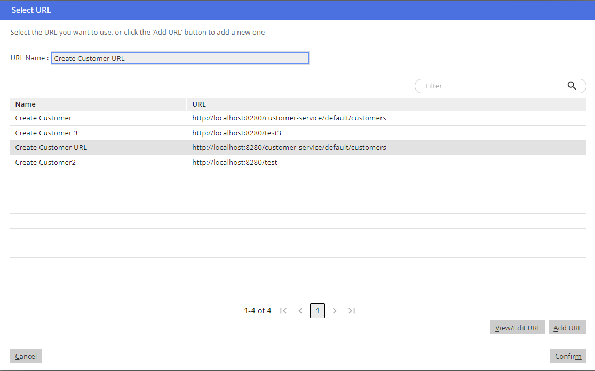

Markdown File Example
=====================

# Uncategorized

## Update Verb Process Descriptor Reference
  
*Template:* [update_verb_process_descriptor_reference.sql](../prj_config/templates/update_verb_process_descriptor_reference.sql)  
*Test:* [test_update_verb_process_descriptor_reference.sql](../prj_config/test_templates/test_update_verb_process_descriptor_reference.sql)

## Add Profile
  
*Template:* [add_profile.sql](../prj_config/templates/add_profile.sql)  
*Test:* [test_add_profile.sql](../prj_config/test_templates/test_add_profile.sql)

## Remove Process Desc Ref
  
*Template:* [remove_process_desc_ref.sql](../prj_config/templates/remove_process_desc_ref.sql)  
*Test:* [test_remove_process_desc_ref.sql](../prj_config/test_templates/test_remove_process_desc_ref.sql)

## Register Channel State Manager Listener
  
*Template:* [register_channel_state_manager_listener.sql](../prj_config/templates/register_channel_state_manager_listener.sql)  
*Test:* [test_register_channel_state_manager_listener.sql](../prj_config/test_templates/test_register_channel_state_manager_listener.sql)

## Add Team Role Type
  
*Template:* [add_team_role_type.sql](../prj_config/templates/add_team_role_type.sql)  
*Test:* [test_add_team_role_type.sql](../prj_config/test_templates/test_add_team_role_type.sql)

## Remove Verb From Entity
  
*Template:* [remove_verb_from_entity.sql](../prj_config/templates/remove_verb_from_entity.sql)  
*Test:* [test_remove_verb_from_entity.sql](../prj_config/test_templates/test_remove_verb_from_entity.sql)

## Add Entitlement To Agent
  
*Template:* [add_entitlement_to_agent.sql](../prj_config/templates/add_entitlement_to_agent.sql)  
*Test:* [test_add_entitlement_to_agent.sql](../prj_config/test_templates/test_add_entitlement_to_agent.sql)

## Add Tab To Ad Right Panel
  
*Template:* [add_tab_to_ad_right_panel.sql](../prj_config/templates/add_tab_to_ad_right_panel.sql)  
*Test:* [test_add_tab_to_ad_right_panel.sql](../prj_config/test_templates/test_add_tab_to_ad_right_panel.sql)

## Extend Verb
  
*Template:* [extend_verb.sql](../prj_config/templates/extend_verb.sql)  
*Test:* [test_extend_verb.sql](../prj_config/test_templates/test_extend_verb.sql)

## Add Localised Field
  
*Template:* [add_localised_field.sql](../prj_config/templates/add_localised_field.sql)  
*Test:* [test_add_localised_field.sql](../prj_config/test_templates/test_add_localised_field.sql)

## Add Verb To Entity
  
*Template:* [add_verb_to_entity.sql](../prj_config/templates/add_verb_to_entity.sql)  
*Test:* [test_add_verb_to_entity.sql](../prj_config/test_templates/test_add_verb_to_entity.sql)

## Remove Activity From Perspective
  
*Template:* [remove_activity_from_perspective.sql](../prj_config/templates/remove_activity_from_perspective.sql)  
*Test:* [test_remove_activity_from_perspective.sql](../prj_config/test_templates/test_remove_activity_from_perspective.sql)

## Remove Team Role Type
  
*Template:* [remove_team_role_type.sql](../prj_config/templates/remove_team_role_type.sql)  
*Test:* [test_remove_team_role_type.sql](../prj_config/test_templates/test_remove_team_role_type.sql)

## Add Category
  
*Template:* [add_category.sql](../prj_config/templates/add_category.sql)  
*Test:* [test_add_category.sql](../prj_config/test_templates/test_add_category.sql)

## Add Perspective
  
*Template:* [add_perspective.sql](../prj_config/templates/add_perspective.sql)  
*Test:* [test_add_perspective.sql](../prj_config/test_templates/test_add_perspective.sql)

## Remove Agent For Dev
  
*Template:* [remove_agent_for_dev.sql](../prj_config/templates/remove_agent_for_dev.sql)  
*Test:* [test_remove_agent_for_dev.sql](../prj_config/test_templates/test_remove_agent_for_dev.sql)

## Update Ccadmin Version
  
*Template:* [update_ccadmin_version.sql](../prj_config/templates/update_ccadmin_version.sql)  
*Test:* [test_update_ccadmin_version.sql](../prj_config/test_templates/test_update_ccadmin_version.sql)

## Add Dynamic Entity View
  
*Template:* [add_dynamic_entity_view.sql](../prj_config/templates/add_dynamic_entity_view.sql)  
*Test:* [test_add_dynamic_entity_view.sql](../prj_config/test_templates/test_add_dynamic_entity_view.sql)

## Add Agent For Dev
  
*Template:* [add_agent_for_dev.sql](../prj_config/templates/add_agent_for_dev.sql)  
*Test:* [test_add_agent_for_dev.sql](../prj_config/test_templates/test_add_agent_for_dev.sql)

## Add Association Type
  
*Template:* [add_association_type.sql](../prj_config/templates/add_association_type.sql)  
*Test:* [test_add_association_type.sql](../prj_config/test_templates/test_add_association_type.sql)

## Insert Username
  
*Template:* [insert_username.sql](../prj_config/templates/insert_username.sql)  
*Test:* [test_insert_username.sql](../prj_config/test_templates/test_insert_username.sql)

## Add Team
  
*Template:* [add_team.sql](../prj_config/templates/add_team.sql)  
*Test:* [test_add_team.sql](../prj_config/test_templates/test_add_team.sql)

## Remove Base Entity
  
*Template:* [remove_base_entity.sql](../prj_config/templates/remove_base_entity.sql)  
*Test:* [test_remove_base_entity.sql](../prj_config/test_templates/test_remove_base_entity.sql)

## Add Team Role
  
*Template:* [add_team_role.sql](../prj_config/templates/add_team_role.sql)  
*Test:* [test_add_team_role.sql](../prj_config/test_templates/test_add_team_role.sql)

## Add Web Integration Host
  
*Template:* [add_web_integration_host.sql](../prj_config/templates/add_web_integration_host.sql)  
*Test:* [test_add_web_integration_host.sql](../prj_config/test_templates/test_add_web_integration_host.sql)

Adds a host which can then be used when building a URL within Rules

## Add Agent
  
*Template:* [add_agent.sql](../prj_config/templates/add_agent.sql)  
*Test:* [test_add_agent.sql](../prj_config/test_templates/test_add_agent.sql)

## Add Activity To Perspective
  
*Template:* [add_activity_to_perspective.sql](../prj_config/templates/add_activity_to_perspective.sql)  
*Test:* [test_add_activity_to_perspective.sql](../prj_config/test_templates/test_add_activity_to_perspective.sql)  
*Tasks:* [Remove Activity From Perspective](#remove-activity-from-perspective), [Toggle Verb User Visible Flag](#toggle-verb-user-visible-flag), [Set Entity Default Instance Verb](#set-entity-default-instance-verb)

## Add Basic Entity Definition
  
*Template:* [add_basic_entity_definition.sql](../prj_config/templates/add_basic_entity_definition.sql)  
*Test:* [test_add_basic_entity_definition.sql](../prj_config/test_templates/test_add_basic_entity_definition.sql)

## Add Dynamic Entity
  
*Template:* [add_dynamic_entity.sql](../prj_config/templates/add_dynamic_entity.sql)  
*Test:* [test_add_dynamic_entity.sql](../prj_config/test_templates/test_add_dynamic_entity.sql)

## Remove Perspective From Profile
  
*Template:* [remove_perspective_from_profile.sql](../prj_config/templates/remove_perspective_from_profile.sql)  
*Test:* [test_remove_perspective_from_profile.sql](../prj_config/test_templates/test_remove_perspective_from_profile.sql)

## Add Agent For Commit
  
*Template:* [add_agent_for_commit.sql](../prj_config/templates/add_agent_for_commit.sql)  
*Test:* [test_add_agent_for_commit.sql](../prj_config/test_templates/test_add_agent_for_commit.sql)

## Add Tag
  
*Template:* [add_tag.sql](../prj_config/templates/add_tag.sql)  
*Test:* [test_add_tag.sql](../prj_config/test_templates/test_add_tag.sql)

## Get Table From Fk Contraint Name
  
*Template:* [get_table_from_fk_contraint_name.sql](../prj_config/templates/get_table_from_fk_contraint_name.sql)  
*Test:* [test_get_table_from_fk_contraint_name.sql](../prj_config/test_templates/test_get_table_from_fk_contraint_name.sql)

## Update Verb Path
  
*Template:* [update_verb_path.sql](../prj_config/templates/update_verb_path.sql)  
*Test:* [test_update_verb_path.sql](../prj_config/test_templates/test_update_verb_path.sql)

## Add Static Menu
  
*Template:* [add_static_menu.sql](../prj_config/templates/add_static_menu.sql)  
*Test:* [test_add_static_menu.sql](../prj_config/test_templates/test_add_static_menu.sql)

## Remove Tab From Ad Right Panel
  
*Template:* [remove_tab_from_ad_right_panel.sql](../prj_config/templates/remove_tab_from_ad_right_panel.sql)  
*Test:* [test_remove_tab_from_ad_right_panel.sql](../prj_config/test_templates/test_remove_tab_from_ad_right_panel.sql)

## Remove Entity Definition
  
*Template:* [remove_entity_definition.sql](../prj_config/templates/remove_entity_definition.sql)  
*Test:* [test_remove_entity_definition.sql](../prj_config/test_templates/test_remove_entity_definition.sql)

## Add Menu Item
  
*Template:* [add_menu_item.sql](../prj_config/templates/add_menu_item.sql)  
*Test:* [test_add_menu_item.sql](../prj_config/test_templates/test_add_menu_item.sql)

## Remove Menu Item
  
*Template:* [remove_menu_item.sql](../prj_config/templates/remove_menu_item.sql)  
*Test:* [test_remove_menu_item.sql](../prj_config/test_templates/test_remove_menu_item.sql)

## Remove Team Role
  
*Template:* [remove_team_role.sql](../prj_config/templates/remove_team_role.sql)  
*Test:* [test_remove_team_role.sql](../prj_config/test_templates/test_remove_team_role.sql)

## Change Max Count Work Area
  
*Template:* [change_max_count_work_area.sql](../prj_config/templates/change_max_count_work_area.sql)  
*Test:* [test_change_max_count_work_area.sql](../prj_config/test_templates/test_change_max_count_work_area.sql)

## Remove Entitlement From Profile
  
*Template:* [remove_entitlement_from_profile.sql](../prj_config/templates/remove_entitlement_from_profile.sql)  
*Test:* [test_remove_entitlement_from_profile.sql](../prj_config/test_templates/test_remove_entitlement_from_profile.sql)

## Add Entitlement To Profile
  
*Template:* [add_entitlement_to_profile.sql](../prj_config/templates/add_entitlement_to_profile.sql)  
*Test:* [test_add_entitlement_to_profile.sql](../prj_config/test_templates/test_add_entitlement_to_profile.sql)

## Add Entitlement
  
*Template:* [add_entitlement.sql](../prj_config/templates/add_entitlement.sql)  
*Test:* [test_add_entitlement.sql](../prj_config/test_templates/test_add_entitlement.sql)

## Config New Content Type
  
*Template:* [config_new_content_type.sql](../prj_config/templates/config_new_content_type.sql)  
*Test:* [test_config_new_content_type.sql](../prj_config/test_templates/test_config_new_content_type.sql)

## Unregister Channel State Manager Listener
  
*Template:* [unregister_channel_state_manager_listener.sql](../prj_config/templates/unregister_channel_state_manager_listener.sql)  
*Test:* [test_unregister_channel_state_manager_listener.sql](../prj_config/test_templates/test_unregister_channel_state_manager_listener.sql)

## Add Content Type
  
*Template:* [add_content_type.sql](../prj_config/templates/add_content_type.sql)  
*Test:* [test_add_content_type.sql](../prj_config/test_templates/test_add_content_type.sql)

## Add Migration Domain
  
*Template:* [add_migration_domain.sql](../prj_config/templates/add_migration_domain.sql)  
*Test:* [test_add_migration_domain.sql](../prj_config/test_templates/test_add_migration_domain.sql)

## Add Activity To Perspective With Seq No
  
*Template:* [add_activity_to_perspective_with_seq_no.sql](../prj_config/templates/add_activity_to_perspective_with_seq_no.sql)  
*Test:* [test_add_activity_to_perspective_with_seq_no.sql](../prj_config/test_templates/test_add_activity_to_perspective_with_seq_no.sql)

## Toggle Verb User Visible Flag
  
*Template:* [toggle_verb_user_visible_flag.sql](../prj_config/templates/toggle_verb_user_visible_flag.sql)  
*Test:* [test_toggle_verb_user_visible_flag.sql](../prj_config/test_templates/test_toggle_verb_user_visible_flag.sql)

## Extend Customer
  
*Template:* [extend_customer.sql](../prj_config/templates/extend_customer.sql)  
*Test:* [test_extend_customer.sql](../prj_config/test_templates/test_extend_customer.sql)

## Add Verb With Existing Pdr
  
*Template:* [add_verb_with_existing_pdr.sql](../prj_config/templates/add_verb_with_existing_pdr.sql)  
*Test:* [test_add_verb_with_existing_pdr.sql](../prj_config/test_templates/test_add_verb_with_existing_pdr.sql)

## Set Entity Default Instance Verb
  
*Template:* [set_entity_default_instance_verb.sql](../prj_config/templates/set_entity_default_instance_verb.sql)  
*Test:* [test_set_entity_default_instance_verb.sql](../prj_config/test_templates/test_set_entity_default_instance_verb.sql)  
*Tasks:* [Toggle Verb User Visible Flag](#toggle-verb-user-visible-flag), [Add Activity To Perspective](#add-activity-to-perspective)  
*Views:* [View Entity Displayed Verbs](#view-entity-displayed-verbs), [View Entity Verbs](#view-entity-verbs)

Determines what verb runs when user clicks on a entity displayed on context

This template prompts to select an entity keyname and then it prompts the instance verbs for that entity. Once the user has selected a verb, the generated SQL runs an update that sets the default instance flag on all the entity verbs to 'N' and then updates the specified verb to 'Y'.

### What is an Entity Default Instance Verb?
On agent desktop, when entity is added into context it displays on the left hand side activities panel showing as title the entities `toString()` result and underneath its "user visible" intance verbs.
User can run each verb by clicking on the verb title. User can also click on the entities title and it will run the default instance verb.
## Update Agent Password
  
*Template:* [update_agent_password.sql](../prj_config/templates/update_agent_password.sql)  
*Test:* [test_update_agent_password.sql](../prj_config/test_templates/test_update_agent_password.sql)

## Add All Background Verbs From Another Profile
  
*Template:* [add_all_background_verbs_from_another_profile.sql](../prj_config/templates/add_all_background_verbs_from_another_profile.sql)  
*Test:* [test_add_all_background_verbs_from_another_profile.sql](../prj_config/test_templates/test_add_all_background_verbs_from_another_profile.sql)

## Remove Entitlement From Agent
  
*Template:* [remove_entitlement_from_agent.sql](../prj_config/templates/remove_entitlement_from_agent.sql)  
*Test:* [test_remove_entitlement_from_agent.sql](../prj_config/test_templates/test_remove_entitlement_from_agent.sql)

## Add Dynamic Entity Def
  
*Template:* [add_dynamic_entity_def.sql](../prj_config/templates/add_dynamic_entity_def.sql)  
*Test:* [test_add_dynamic_entity_def.sql](../prj_config/test_templates/test_add_dynamic_entity_def.sql)

## Remove Background Verb From Profile
  
*Template:* [remove_background_verb_from_profile.sql](../prj_config/templates/remove_background_verb_from_profile.sql)  
*Test:* [test_remove_background_verb_from_profile.sql](../prj_config/test_templates/test_remove_background_verb_from_profile.sql)

## Add Entity Definition
  
*Template:* [add_entity_definition.sql](../prj_config/templates/add_entity_definition.sql)  
*Test:* [test_add_entity_definition.sql](../prj_config/test_templates/test_add_entity_definition.sql)

## Remove Entitlement From Verb
  
*Template:* [remove_entitlement_from_verb.sql](../prj_config/templates/remove_entitlement_from_verb.sql)  
*Test:* [test_remove_entitlement_from_verb.sql](../prj_config/test_templates/test_remove_entitlement_from_verb.sql)

## Add Perspective To Profile
  
*Template:* [add_perspective_to_profile.sql](../prj_config/templates/add_perspective_to_profile.sql)  
*Test:* [test_add_perspective_to_profile.sql](../prj_config/test_templates/test_add_perspective_to_profile.sql)

## Add Entitlement To Verb
  
*Template:* [add_entitlement_to_verb.sql](../prj_config/templates/add_entitlement_to_verb.sql)  
*Test:* [test_add_entitlement_to_verb.sql](../prj_config/test_templates/test_add_entitlement_to_verb.sql)

## Add Url With Smartmatch Purpose
  
*Template:* [add_url_with_smartmatch_purpose.sql](../prj_config/templates/add_url_with_smartmatch_purpose.sql)  
*Test:* [test_add_url_with_smartmatch_purpose.sql](../prj_config/test_templates/test_add_url_with_smartmatch_purpose.sql)

Adds a URL and makes it available to be used in rules editor

A use case is setting up an inbound rule, within the Rules Editor, which calls a URL when something happens.
For example creating a customer when the customer is not identified. We could do that by make a request to create customer URL REST API. This URL needs to be previously configured and saved in the database. This is what this template does.
Currently only saves to the URL table, it does not save to FWI_URL_HEADER or FWI_URL_PARAM table. Once we encounter a use case that needs to save to those tables this template should be modified to save to those tables as well.
Note also that "EXPORT_LOCALE" is set "N", this is equivalent to make this URL non migratable, we do this because we are scripting and any modification to the rule is expected to be done through script, not using migration.  
  
**Image: 1**  
  
  
**Image: 2**  

## Update Localised Field
  
*Template:* [update_localised_field.sql](../prj_config/templates/update_localised_field.sql)  
*Test:* [test_update_localised_field.sql](../prj_config/test_templates/test_update_localised_field.sql)

## Add Team Position
  
*Template:* [add_team_position.sql](../prj_config/templates/add_team_position.sql)  
*Test:* [test_add_team_position.sql](../prj_config/test_templates/test_add_team_position.sql)

## Add Profile To Agent
  
*Template:* [add_profile_to_agent.sql](../prj_config/templates/add_profile_to_agent.sql)  
*Test:* [test_add_profile_to_agent.sql](../prj_config/test_templates/test_add_profile_to_agent.sql)

## Remove View Contact Tab
  
*Template:* [remove_view_contact_tab.sql](../prj_config/templates/remove_view_contact_tab.sql)  
*Test:* [test_remove_view_contact_tab.sql](../prj_config/test_templates/test_remove_view_contact_tab.sql)

## Add Process Descriptor
  
*Template:* [add_process_descriptor.sql](../prj_config/templates/add_process_descriptor.sql)  
*Test:* [test_add_process_descriptor.sql](../prj_config/test_templates/test_add_process_descriptor.sql)

## Remove Entitlement From Team
  
*Template:* [remove_entitlement_from_team.sql](../prj_config/templates/remove_entitlement_from_team.sql)  
*Test:* [test_remove_entitlement_from_team.sql](../prj_config/test_templates/test_remove_entitlement_from_team.sql)

## Add Background Verb To Profile
  
*Template:* [add_background_verb_to_profile.sql](../prj_config/templates/add_background_verb_to_profile.sql)  
*Test:* [test_add_background_verb_to_profile.sql](../prj_config/test_templates/test_add_background_verb_to_profile.sql)

## Add Dynamic Entity View Field
  
*Template:* [add_dynamic_entity_view_field.sql](../prj_config/templates/add_dynamic_entity_view_field.sql)  
*Test:* [test_add_dynamic_entity_view_field.sql](../prj_config/test_templates/test_add_dynamic_entity_view_field.sql)

## Remove Team
  
*Template:* [remove_team.sql](../prj_config/templates/remove_team.sql)  
*Test:* [test_remove_team.sql](../prj_config/test_templates/test_remove_team.sql)

## Add Background Verb
  
*Template:* [add_background_verb.sql](../prj_config/templates/add_background_verb.sql)  
*Test:* [test_add_background_verb.sql](../prj_config/test_templates/test_add_background_verb.sql)

## Remove Profile From Agent
  
*Template:* [remove_profile_from_agent.sql](../prj_config/templates/remove_profile_from_agent.sql)  
*Test:* [test_remove_profile_from_agent.sql](../prj_config/test_templates/test_remove_profile_from_agent.sql)

## Extend Verb With Config
  
*Template:* [extend_verb_with_config.sql](../prj_config/templates/extend_verb_with_config.sql)  
*Test:* [test_extend_verb_with_config.sql](../prj_config/test_templates/test_extend_verb_with_config.sql)

## Rewire Verb
  
*Template:* [rewire_verb.sql](../prj_config/templates/rewire_verb.sql)  
*Test:* [test_rewire_verb.sql](../prj_config/test_templates/test_rewire_verb.sql)

## Extend Entity
  
*Template:* [extend_entity.sql](../prj_config/templates/extend_entity.sql)  
*Test:* [test_extend_entity.sql](../prj_config/test_templates/test_extend_entity.sql)

## Add View Contact Tab
  
*Template:* [add_view_contact_tab.sql](../prj_config/templates/add_view_contact_tab.sql)  
*Test:* [test_add_view_contact_tab.sql](../prj_config/test_templates/test_add_view_contact_tab.sql)

## Add Dynamic Entity Field
  
*Template:* [add_dynamic_entity_field.sql](../prj_config/templates/add_dynamic_entity_field.sql)  
*Test:* [test_add_dynamic_entity_field.sql](../prj_config/test_templates/test_add_dynamic_entity_field.sql)

## Test Register Channel State Manager Listener
  
*Template:* [test_register_channel_state_manager_listener.sql](../prj_config/templates/test_register_channel_state_manager_listener.sql)  
*Test:* [test_test_register_channel_state_manager_listener.sql](../prj_config/test_templates/test_test_register_channel_state_manager_listener.sql)

## Add Dynamic Content Verb
  
*Template:* [add_dynamic_content_verb.sql](../prj_config/templates/add_dynamic_content_verb.sql)  
*Test:* [test_add_dynamic_content_verb.sql](../prj_config/test_templates/test_add_dynamic_content_verb.sql)

## Add Entitlement To Team
  
*Template:* [add_entitlement_to_team.sql](../prj_config/templates/add_entitlement_to_team.sql)  
*Test:* [test_add_entitlement_to_team.sql](../prj_config/test_templates/test_add_entitlement_to_team.sql)

## View Verb By Keyname
  
*Template:* [view_verb_by_keyname.sql](../prj_config/templates/views/view_verb_by_keyname.sql)  
*Test:* [test_view_verb_by_keyname.sql](../prj_config/test_templates/views/test_view_verb_by_keyname.sql)

## View Verb Entitlements
  
*Template:* [view_verb_entitlements.sql](../prj_config/templates/views/view_verb_entitlements.sql)  
*Test:* [test_view_verb_entitlements.sql](../prj_config/test_templates/views/test_view_verb_entitlements.sql)

## View Verbs From Repo Path
  
*Template:* [view_verbs_from_repo_path.sql](../prj_config/templates/views/view_verbs_from_repo_path.sql)  
*Test:* [test_view_verbs_from_repo_path.sql](../prj_config/test_templates/views/test_view_verbs_from_repo_path.sql)

## View Agent Profile Background Vebs
  
*Template:* [view_agent_profile_background_vebs.sql](../prj_config/templates/views/view_agent_profile_background_vebs.sql)  
*Test:* [test_view_agent_profile_background_vebs.sql](../prj_config/test_templates/views/test_view_agent_profile_background_vebs.sql)

## View Entitydef By Keyname
  
*Template:* [view_entitydef_by_keyname.sql](../prj_config/templates/views/view_entitydef_by_keyname.sql)  
*Test:* [test_view_entitydef_by_keyname.sql](../prj_config/test_templates/views/test_view_entitydef_by_keyname.sql)

## View Keynames
  
*Template:* [view_keynames.sql](../prj_config/templates/views/view_keynames.sql)  
*Test:* [test_view_keynames.sql](../prj_config/test_templates/views/test_view_keynames.sql)

## View User Profiles
  
*Template:* [view_user_profiles.sql](../prj_config/templates/views/view_user_profiles.sql)  
*Test:* [test_view_user_profiles.sql](../prj_config/test_templates/views/test_view_user_profiles.sql)

## View Process Descriptor Ref By Repo Path
  
*Template:* [view_process_descriptor_ref_by_repo_path.sql](../prj_config/templates/views/view_process_descriptor_ref_by_repo_path.sql)  
*Test:* [test_view_process_descriptor_ref_by_repo_path.sql](../prj_config/test_templates/views/test_view_process_descriptor_ref_by_repo_path.sql)

## View Entity Verbs
  
*Template:* [view_entity_verbs.sql](../prj_config/templates/views/view_entity_verbs.sql)  
*Test:* [test_view_entity_verbs.sql](../prj_config/test_templates/views/test_view_entity_verbs.sql)

## View Agent
  
*Template:* [view_agent.sql](../prj_config/templates/views/view_agent.sql)  
*Test:* [test_view_agent.sql](../prj_config/test_templates/views/test_view_agent.sql)

## View Ad Right Panel Tabs Verbs
  
*Template:* [view_ad_right_panel_tabs_verbs.sql](../prj_config/templates/views/view_ad_right_panel_tabs_verbs.sql)  
*Test:* [test_view_ad_right_panel_tabs_verbs.sql](../prj_config/test_templates/views/test_view_ad_right_panel_tabs_verbs.sql)

## View Entity Displayed Verbs
  
*Template:* [view_entity_displayed_verbs.sql](../prj_config/templates/views/view_entity_displayed_verbs.sql)  
*Test:* [test_view_entity_displayed_verbs.sql](../prj_config/test_templates/views/test_view_entity_displayed_verbs.sql)

## View Entity Verbs Keynames
  
*Template:* [view_entity_verbs_keynames.sql](../prj_config/templates/views/view_entity_verbs_keynames.sql)  
*Test:* [test_view_entity_verbs_keynames.sql](../prj_config/test_templates/views/test_view_entity_verbs_keynames.sql)

## View Entity Definition
  
*Template:* [view_entity_definition.sql](../prj_config/templates/views/view_entity_definition.sql)  
*Test:* [test_view_entity_definition.sql](../prj_config/test_templates/views/test_view_entity_definition.sql)

## View Entitlements By System Name
  
*Template:* [view_entitlements_by_system_name.sql](../prj_config/templates/views/view_entitlements_by_system_name.sql)  
*Test:* [test_view_entitlements_by_system_name.sql](../prj_config/test_templates/views/test_view_entitlements_by_system_name.sql)

## View Channel State Manager Listeners
  
*Template:* [view_channel_state_manager_listeners.sql](../prj_config/templates/views/view_channel_state_manager_listeners.sql)  
*Test:* [test_view_channel_state_manager_listeners.sql](../prj_config/test_templates/views/test_view_channel_state_manager_listeners.sql)

## View Profile Verbs
  
*Template:* [view_profile_verbs.sql](../prj_config/templates/views/view_profile_verbs.sql)  
*Test:* [test_view_profile_verbs.sql](../prj_config/test_templates/views/test_view_profile_verbs.sql)

## View Profile Entitlements
  
*Template:* [view_profile_entitlements.sql](../prj_config/templates/views/view_profile_entitlements.sql)  
*Test:* [test_view_profile_entitlements.sql](../prj_config/test_templates/views/test_view_profile_entitlements.sql)

## Autologin On Css
  
*Template:* [autologin_on_css.sql](../prj_config/templates/pacificorp/autologin_on_css.sql)  
*Test:* [test_autologin_on_css.sql](../prj_config/test_templates/pacificorp/test_autologin_on_css.sql)

## Add Menu Verb To Entity
  
*Template:* [add_menu_verb_to_entity.sql](../prj_config/templates/pacificorp/add_menu_verb_to_entity.sql)  
*Test:* [test_add_menu_verb_to_entity.sql](../prj_config/test_templates/pacificorp/test_add_menu_verb_to_entity.sql)

## Base Add Entity Def
  
*Template:* [base_add_entity_def.sql](../prj_config/templates/hidden_templates/base_add_entity_def.sql)  
*Test:* [test_base_add_entity_def.sql](../prj_config/test_templates/hidden_templates/test_base_add_entity_def.sql)

## Generic Set Update Values
  
*Template:* [generic_set_update_values.sql](../prj_config/templates/hidden_templates/generic_set_update_values.sql)  
*Test:* [test_generic_set_update_values.sql](../prj_config/test_templates/hidden_templates/test_generic_set_update_values.sql)

## Insert Dynamic Verb Parameter
  
*Template:* [insert_dynamic_verb_parameter.sql](../prj_config/templates/hidden_templates/insert_dynamic_verb_parameter.sql)  
*Test:* [test_insert_dynamic_verb_parameter.sql](../prj_config/test_templates/hidden_templates/test_insert_dynamic_verb_parameter.sql)

## Add Process Descriptor Ref
  
*Template:* [add_process_descriptor_ref.sql](../prj_config/templates/hidden_templates/add_process_descriptor_ref.sql)  
*Test:* [test_add_process_descriptor_ref.sql](../prj_config/test_templates/hidden_templates/test_add_process_descriptor_ref.sql)

## Remove Idmap
  
*Template:* [remove_idmap.sql](../prj_config/templates/hidden_templates/remove_idmap.sql)  
*Test:* [test_remove_idmap.sql](../prj_config/test_templates/hidden_templates/test_remove_idmap.sql)

## Remove Dynamic Verb List
  
*Template:* [remove_dynamic_verb_list.sql](../prj_config/templates/hidden_templates/remove_dynamic_verb_list.sql)  
*Test:* [test_remove_dynamic_verb_list.sql](../prj_config/test_templates/hidden_templates/test_remove_dynamic_verb_list.sql)

## Insert Context Verb Entry
  
*Template:* [insert_context_verb_entry.sql](../prj_config/templates/hidden_templates/insert_context_verb_entry.sql)  
*Test:* [test_insert_context_verb_entry.sql](../prj_config/test_templates/hidden_templates/test_insert_context_verb_entry.sql)

## Add Entity Entitlement
  
*Template:* [add_entity_entitlement.sql](../prj_config/templates/hidden_templates/add_entity_entitlement.sql)  
*Test:* [test_add_entity_entitlement.sql](../prj_config/test_templates/hidden_templates/test_add_entity_entitlement.sql)

## Insert Dynamic Verb List
  
*Template:* [insert_dynamic_verb_list.sql](../prj_config/templates/hidden_templates/insert_dynamic_verb_list.sql)  
*Test:* [test_insert_dynamic_verb_list.sql](../prj_config/test_templates/hidden_templates/test_insert_dynamic_verb_list.sql)

## Add Profile
  
*Template:* [add_profile.sql](../prj_config/templates/__add_profile/add_profile.sql)  
*Test:* [test_add_profile.sql](../prj_config/test_templates/__add_profile/test_add_profile.sql)

## Add Profile
  
*Template:* [add_profile.sql](../prj_config/templates/__add_profile/pre_8.5.0/add_profile.sql)  
*Test:* [test_add_profile.sql](../prj_config/test_templates/__add_profile/pre_8.5.0/test_add_profile.sql)

