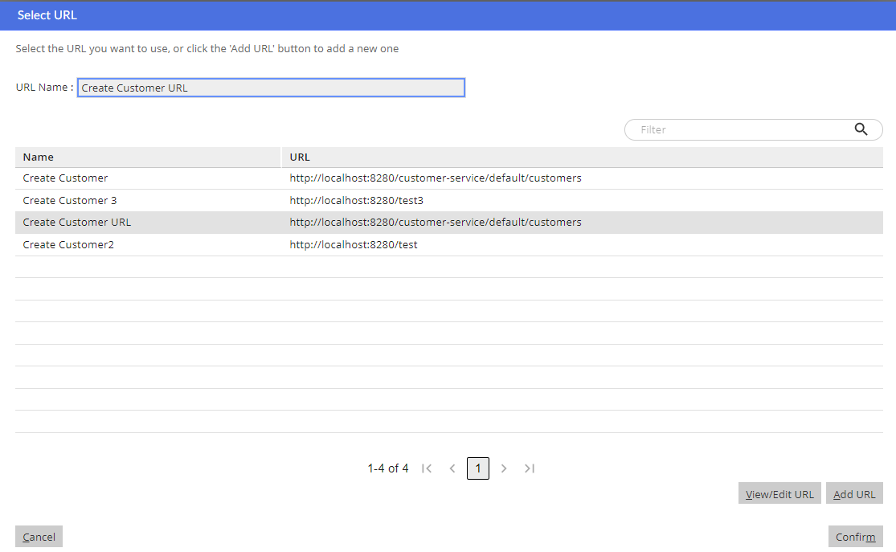

SQLTask Library
===============

The SQL tasks library has currently a total of 113 templates, divided in 4 sections; 80 [scripts](#scripts), 9 [hidden_templates](#hidden_templates), 6 [tutorials](#tutorials), 18 [views](#views)

Tables of Contents
==================

* [scripts](#scripts)
	* [Add Activity To Perspective](#add-activity-to-perspective)
	* [Add Activity To Perspective With Seq No](#add-activity-to-perspective-with-seq-no)
	* [Add Agent For Commit](#add-agent-for-commit)
	* [Add Agent For Dev](#add-agent-for-dev)
	* [Add All Background Verbs From Another Profile](#add-all-background-verbs-from-another-profile)
	* [Add Association Type](#add-association-type)
	* [Add Background Verb](#add-background-verb)
	* [Add Background Verb To Profile](#add-background-verb-to-profile)
	* [Add Basic Entity Definition](#add-basic-entity-definition)
	* [Add Category](#add-category)
	* [Add Content Type](#add-content-type)
	* [Add Dynamic Content Verb](#add-dynamic-content-verb)
	* [Add Dynamic Entity](#add-dynamic-entity)
	* [Add Dynamic Entity Def](#add-dynamic-entity-def)
	* [Add Dynamic Entity Field](#add-dynamic-entity-field)
	* [Add Dynamic Entity View](#add-dynamic-entity-view)
	* [Add Dynamic Entity View Field](#add-dynamic-entity-view-field)
	* [Add Entitlement](#add-entitlement)
	* [Add Entitlement To Agent](#add-entitlement-to-agent)
	* [Add Entitlement To Profile](#add-entitlement-to-profile)
	* [Add Entitlement To Team](#add-entitlement-to-team)
	* [Add Entitlement To Verb](#add-entitlement-to-verb)
	* [Add Entity Definition](#add-entity-definition)
	* [Add Localised Field](#add-localised-field)
	* [Add Menu Item](#add-menu-item)
	* [Add Migration Domain](#add-migration-domain)
	* [Add Perspective](#add-perspective)
	* [Add Perspective To Profile](#add-perspective-to-profile)
	* [Add Process Descriptor](#add-process-descriptor)
	* [Add Profile](#add-profile)
	* [Add Profile To Agent](#add-profile-to-agent)
	* [Add Static Menu](#add-static-menu)
	* [Add Tab To Ad Right Panel](#add-tab-to-ad-right-panel)
	* [Add Tag](#add-tag)
	* [Add Team](#add-team)
	* [Add Team Position](#add-team-position)
	* [Add Team Role](#add-team-role)
	* [Add Team Role Type](#add-team-role-type)
	* [Add Url With Smartmatch Purpose](#add-url-with-smartmatch-purpose)
	* [Add Verb To Entity](#add-verb-to-entity)
	* [Add Verb With Existing Pdr](#add-verb-with-existing-pdr)
	* [Add View Contact Tab](#add-view-contact-tab)
	* [Add Web Integration Host](#add-web-integration-host)
	* [Change Max Count Work Area](#change-max-count-work-area)
	* [Config New Content Type](#config-new-content-type)
	* [Extend Customer](#extend-customer)
	* [Extend Entity](#extend-entity)
	* [Extend Verb](#extend-verb)
	* [Extend Verb With Config](#extend-verb-with-config)
	* [Get Table From Fk Contraint Name](#get-table-from-fk-contraint-name)
	* [How To Add Content Type](#how-to-add-content-type)
	* [Register Channel State Manager Listener](#register-channel-state-manager-listener)
	* [Remove Activity From Perspective](#remove-activity-from-perspective)
	* [Remove Agent For Dev](#remove-agent-for-dev)
	* [Remove Background Verb From Profile](#remove-background-verb-from-profile)
	* [Remove Base Entity](#remove-base-entity)
	* [Remove Entitlement From Agent](#remove-entitlement-from-agent)
	* [Remove Entitlement From Profile](#remove-entitlement-from-profile)
	* [Remove Entitlement From Team](#remove-entitlement-from-team)
	* [Remove Entitlement From Verb](#remove-entitlement-from-verb)
	* [Remove Entity Definition](#remove-entity-definition)
	* [Remove Menu Item](#remove-menu-item)
	* [Remove Perspective From Profile](#remove-perspective-from-profile)
	* [Remove Process Desc Ref](#remove-process-desc-ref)
	* [Remove Profile From Agent](#remove-profile-from-agent)
	* [Remove Tab From Ad Right Panel](#remove-tab-from-ad-right-panel)
	* [Remove Team](#remove-team)
	* [Remove Team Role](#remove-team-role)
	* [Remove Team Role Type](#remove-team-role-type)
	* [Remove Verb From Entity](#remove-verb-from-entity)
	* [Remove View Contact Tab](#remove-view-contact-tab)
	* [Reorder Dynamic View Field](#reorder-dynamic-view-field)
	* [Set Entity Default Instance Verb](#set-entity-default-instance-verb)
	* [Unregister Channel State Manager Listener](#unregister-channel-state-manager-listener)
	* [Update Agent Password](#update-agent-password)
	* [Update Ccadmin Version](#update-ccadmin-version)
	* [Update Localised Field](#update-localised-field)
	* [Update Verb Path](#update-verb-path)
	* [Update Verb Process Descriptor Reference](#update-verb-process-descriptor-reference)
	* [Update Verb User Visible Flag](#update-verb-user-visible-flag)
* [hidden_templates](#hidden_templates)
	* [Add Entity Entitlement](#add-entity-entitlement)
	* [Add Process Descriptor Ref](#add-process-descriptor-ref)
	* [Base Add Entity Def](#base-add-entity-def)
	* [Generic Set Update Values](#generic-set-update-values)
	* [Insert Context Verb Entry](#insert-context-verb-entry)
	* [Insert Dynamic Verb List](#insert-dynamic-verb-list)
	* [Insert Dynamic Verb Parameter](#insert-dynamic-verb-parameter)
	* [Remove Dynamic Verb List](#remove-dynamic-verb-list)
	* [Remove Idmap](#remove-idmap)
* [tutorials](#tutorials)
	* [Filters](#filters)
	* [Globals And String Functions Tutorial](#globals-and-string-functions-tutorial)
	* [Include](#include)
	* [Keynames](#keynames)
	* [Querying Db](#querying-db)
	* [Variable And Prompts](#variable-and-prompts)
* [views](#views)
	* [View Ad Right Panel Tabs Verbs](#view-ad-right-panel-tabs-verbs)
	* [View Agent](#view-agent)
	* [View Agent Profile Background Vebs](#view-agent-profile-background-vebs)
	* [View Channel State Manager Listeners](#view-channel-state-manager-listeners)
	* [View Entitlements By System Name](#view-entitlements-by-system-name)
	* [View Entity Definition](#view-entity-definition)
	* [View Entity Displayed Verbs](#view-entity-displayed-verbs)
	* [View Entity Verbs](#view-entity-verbs)
	* [View Entity Verbs Keynames](#view-entity-verbs-keynames)
	* [View Entitydef By Keyname](#view-entitydef-by-keyname)
	* [View Keynames](#view-keynames)
	* [View Process Descriptor Ref By Repo Path](#view-process-descriptor-ref-by-repo-path)
	* [View Profile Entitlements](#view-profile-entitlements)
	* [View Profile Verbs](#view-profile-verbs)
	* [View User Profiles](#view-user-profiles)
	* [View Verb By Keyname](#view-verb-by-keyname)
	* [View Verb Entitlements](#view-verb-entitlements)
	* [View Verbs From Repo Path](#view-verbs-from-repo-path)

# scripts
  
There are currently 80 templates in this section
## Add Activity To Perspective
  
*Template:* [add_activity_to_perspective.sql](../library/templates/add_activity_to_perspective.sql)  
*Test:* [test_add_activity_to_perspective.sql](../library/test_templates/test_add_activity_to_perspective.sql)  
*Related Tasks:* [Remove Activity From Perspective](#remove-activity-from-perspective), [Update Verb User Visible Flag](#update-verb-user-visible-flag), [Set Entity Default Instance Verb](#set-entity-default-instance-verb)

  
  
**Images**  

## Add Activity To Perspective With Seq No
  
*Template:* [add_activity_to_perspective_with_seq_no.sql](../library/templates/add_activity_to_perspective_with_seq_no.sql)  
*Test:* [test_add_activity_to_perspective_with_seq_no.sql](../library/test_templates/test_add_activity_to_perspective_with_seq_no.sql)

  
  
**Images**  

## Add Agent For Commit
  
*Template:* [add_agent_for_commit.sql](../library/templates/add_agent_for_commit.sql)

  
  
**Images**  

## Add Agent For Dev
  
*Template:* [add_agent_for_dev.sql](../library/templates/add_agent_for_dev.sql)  
*Test:* [test_add_agent_for_dev.sql](../library/test_templates/test_add_agent_for_dev.sql)

  
  
**Images**  

## Add All Background Verbs From Another Profile
  
*Template:* [add_all_background_verbs_from_another_profile.sql](../library/templates/add_all_background_verbs_from_another_profile.sql)

  
  
**Images**  

## Add Association Type
  
*Template:* [add_association_type.sql](../library/templates/add_association_type.sql)  
*Test:* [test_add_association_type.sql](../library/test_templates/test_add_association_type.sql)

  
  
**Images**  

## Add Background Verb
  
*Template:* [add_background_verb.sql](../library/templates/add_background_verb.sql)  
*Test:* [test_add_background_verb.sql](../library/test_templates/test_add_background_verb.sql)

  
  
**Images**  

## Add Background Verb To Profile
  
*Template:* [add_background_verb_to_profile.sql](../library/templates/add_background_verb_to_profile.sql)  
*Test:* [test_add_background_verb_to_profile.sql](../library/test_templates/test_add_background_verb_to_profile.sql)

  
  
**Images**  

## Add Basic Entity Definition
  
*Template:* [add_basic_entity_definition.sql](../library/templates/add_basic_entity_definition.sql)

  
  
**Images**  

## Add Category
  
*Template:* [add_category.sql](../library/templates/add_category.sql)  
*Test:* [test_add_category.sql](../library/test_templates/test_add_category.sql)

  
  
**Images**  

## Add Content Type
  
*Template:* [add_content_type.sql](../library/templates/add_content_type.sql)  
*Test:* [test_add_content_type.sql](../library/test_templates/test_add_content_type.sql)

  
  
**Images**  

## Add Dynamic Content Verb
  
*Template:* [add_dynamic_content_verb.sql](../library/templates/add_dynamic_content_verb.sql)  
*Test:* [test_add_dynamic_content_verb.sql](../library/test_templates/test_add_dynamic_content_verb.sql)

  
  
**Images**  

## Add Dynamic Entity
  
*Template:* [add_dynamic_entity.sql](../library/templates/add_dynamic_entity.sql)  
*Test:* [test_add_dynamic_entity.sql](../library/test_templates/test_add_dynamic_entity.sql)

  
  
**Images**  

## Add Dynamic Entity Def
  
*Template:* [add_dynamic_entity_def.sql](../library/templates/add_dynamic_entity_def.sql)

  
  
**Images**  

## Add Dynamic Entity Field
  
*Template:* [add_dynamic_entity_field.sql](../library/templates/add_dynamic_entity_field.sql)  
*Test:* [test_add_dynamic_entity_field.sql](../library/test_templates/test_add_dynamic_entity_field.sql)

  
  
**Images**  

## Add Dynamic Entity View
  
*Template:* [add_dynamic_entity_view.sql](../library/templates/add_dynamic_entity_view.sql)  
*Test:* [test_add_dynamic_entity_view.sql](../library/test_templates/test_add_dynamic_entity_view.sql)

  
  
**Images**  

## Add Dynamic Entity View Field
  
*Template:* [add_dynamic_entity_view_field.sql](../library/templates/add_dynamic_entity_view_field.sql)  
*Test:* [test_add_dynamic_entity_view_field.sql](../library/test_templates/test_add_dynamic_entity_view_field.sql)

  
  
**Images**  

## Add Entitlement
  
*Template:* [add_entitlement.sql](../library/templates/add_entitlement.sql)  
*Test:* [test_add_entitlement.sql](../library/test_templates/test_add_entitlement.sql)

  
  
**Images**  

## Add Entitlement To Agent
  
*Template:* [add_entitlement_to_agent.sql](../library/templates/add_entitlement_to_agent.sql)  
*Test:* [test_add_entitlement_to_agent.sql](../library/test_templates/test_add_entitlement_to_agent.sql)

  
  
**Images**  

## Add Entitlement To Profile
  
*Template:* [add_entitlement_to_profile.sql](../library/templates/add_entitlement_to_profile.sql)  
*Test:* [test_add_entitlement_to_profile.sql](../library/test_templates/test_add_entitlement_to_profile.sql)

  
  
**Images**  

## Add Entitlement To Team
  
*Template:* [add_entitlement_to_team.sql](../library/templates/add_entitlement_to_team.sql)  
*Test:* [test_add_entitlement_to_team.sql](../library/test_templates/test_add_entitlement_to_team.sql)

  
  
**Images**  

## Add Entitlement To Verb
  
*Template:* [add_entitlement_to_verb.sql](../library/templates/add_entitlement_to_verb.sql)  
*Test:* [test_add_entitlement_to_verb.sql](../library/test_templates/test_add_entitlement_to_verb.sql)

  
  
**Images**  

## Add Entity Definition
  
*Template:* [add_entity_definition.sql](../library/templates/add_entity_definition.sql)  
*Test:* [test_add_entity_definition.sql](../library/test_templates/test_add_entity_definition.sql)

  
  
**Images**  

## Add Localised Field
  
*Template:* [add_localised_field.sql](../library/templates/add_localised_field.sql)

  
  
**Images**  

## Add Menu Item
  
*Template:* [add_menu_item.sql](../library/templates/add_menu_item.sql)  
*Test:* [test_add_menu_item.sql](../library/test_templates/test_add_menu_item.sql)

  
  
**Images**  

## Add Migration Domain
  
*Template:* [add_migration_domain.sql](../library/templates/add_migration_domain.sql)

  
  
**Images**  

## Add Perspective
  
*Template:* [add_perspective.sql](../library/templates/add_perspective.sql)  
*Test:* [test_add_perspective.sql](../library/test_templates/test_add_perspective.sql)

  
  
**Images**  

## Add Perspective To Profile
  
*Template:* [add_perspective_to_profile.sql](../library/templates/add_perspective_to_profile.sql)  
*Test:* [test_add_perspective_to_profile.sql](../library/test_templates/test_add_perspective_to_profile.sql)

  
  
**Images**  

## Add Process Descriptor
  
*Template:* [add_process_descriptor.sql](../library/templates/add_process_descriptor.sql)  
*Test:* [test_add_process_descriptor.sql](../library/test_templates/test_add_process_descriptor.sql)

  
  
**Images**  

## Add Profile
  
*Template:* [add_profile.sql](../library/templates/add_profile.sql)  
*Test:* [test_add_profile.sql](../library/test_templates/test_add_profile.sql)

  
  
**Images**  

## Add Profile To Agent
  
*Template:* [add_profile_to_agent.sql](../library/templates/add_profile_to_agent.sql)  
*Test:* [test_add_profile_to_agent.sql](../library/test_templates/test_add_profile_to_agent.sql)

  
  
**Images**  

## Add Static Menu
  
*Template:* [add_static_menu.sql](../library/templates/add_static_menu.sql)  
*Test:* [test_add_static_menu.sql](../library/test_templates/test_add_static_menu.sql)

  
  
**Images**  

## Add Tab To Ad Right Panel
  
*Template:* [add_tab_to_ad_right_panel.sql](../library/templates/add_tab_to_ad_right_panel.sql)

  
  
**Images**  

## Add Tag
  
*Template:* [add_tag.sql](../library/templates/add_tag.sql)  
*Test:* [test_add_tag.sql](../library/test_templates/test_add_tag.sql)

  
  
**Images**  

## Add Team
  
*Template:* [add_team.sql](../library/templates/add_team.sql)  
*Test:* [test_add_team.sql](../library/test_templates/test_add_team.sql)

  
  
**Images**  

## Add Team Position
  
*Template:* [add_team_position.sql](../library/templates/add_team_position.sql)  
*Test:* [test_add_team_position.sql](../library/test_templates/test_add_team_position.sql)

  
  
**Images**  

## Add Team Role
  
*Template:* [add_team_role.sql](../library/templates/add_team_role.sql)  
*Test:* [test_add_team_role.sql](../library/test_templates/test_add_team_role.sql)

  
  
**Images**  

## Add Team Role Type
  
*Template:* [add_team_role_type.sql](../library/templates/add_team_role_type.sql)  
*Test:* [test_add_team_role_type.sql](../library/test_templates/test_add_team_role_type.sql)

  
  
**Images**  

## Add Url With Smartmatch Purpose
  
*Template:* [add_url_with_smartmatch_purpose.sql](../library/templates/add_url_with_smartmatch_purpose.sql)  
*Test:* [test_add_url_with_smartmatch_purpose.sql](../library/test_templates/test_add_url_with_smartmatch_purpose.sql)

Adds a URL and makes it available to be used in rules editor

A use case is setting up an inbound rule, within the Rules Editor, which calls a URL when something happens.
For example creating a customer when the customer is not identified. We could do that by making a request to create customer URL REST API. This URL needs to be previously configured and saved in the database. This is what this template does.

Currently only saves to the URL table, it does not save to FWI_URL_HEADER or FWI_URL_PARAM table. Once we encounter a use case that needs to save to those tables this template should be modified to save to those tables as well.

Note also that "EXPORT_LOCALE" is set "N", this is equivalent to make this URL non migratable, we do this because we are scripting and any modification to the rule is expected to be done through script, not using migration.  
  
**Images**  
  
  
**
Image 1
**  
  
  
**
Image 2
**  

## Add Verb To Entity
  
*Template:* [add_verb_to_entity.sql](../library/templates/add_verb_to_entity.sql)  
*Test:* [test_add_verb_to_entity.sql](../library/test_templates/test_add_verb_to_entity.sql)

  
  
**Images**  

## Add Verb With Existing Pdr
  
*Template:* [add_verb_with_existing_pdr.sql](../library/templates/add_verb_with_existing_pdr.sql)

  
  
**Images**  

## Add View Contact Tab
  
*Template:* [add_view_contact_tab.sql](../library/templates/add_view_contact_tab.sql)  
*Test:* [test_add_view_contact_tab.sql](../library/test_templates/test_add_view_contact_tab.sql)

  
  
**Images**  

## Add Web Integration Host
  
*Template:* [add_web_integration_host.groovy](../library/templates/add_web_integration_host.groovy)  
*Test:* [test_add_web_integration_host.groovy](../library/test_templates/test_add_web_integration_host.groovy)

  
  
**Images**  

## Change Max Count Work Area
  
*Template:* [change_max_count_work_area.sql](../library/templates/change_max_count_work_area.sql)  
*Test:* [test_change_max_count_work_area.sql](../library/test_templates/test_change_max_count_work_area.sql)

  
  
**Images**  

## Config New Content Type
  
*Template:* [config_new_content_type.sql](../library/templates/config_new_content_type.sql)

  
  
**Images**  

## Extend Customer
  
*Template:* [extend_customer.sql](../library/templates/extend_customer.sql)  
*Test:* [test_extend_customer.sql](../library/test_templates/test_extend_customer.sql)

  
  
**Images**  

## Extend Entity
  
*Template:* [extend_entity.sql](../library/templates/extend_entity.sql)  
*Test:* [test_extend_entity.sql](../library/test_templates/test_extend_entity.sql)

  
  
**Images**  

## Extend Verb
  
*Template:* [extend_verb.sql](../library/templates/extend_verb.sql)  
*Test:* [test_extend_verb.sql](../library/test_templates/test_extend_verb.sql)

  
  
**Images**  

## Extend Verb With Config
  
*Template:* [extend_verb_with_config.sql](../library/templates/extend_verb_with_config.sql)  
*Test:* [test_extend_verb_with_config.sql](../library/test_templates/test_extend_verb_with_config.sql)

  
  
**Images**  

## Get Table From Fk Contraint Name
  
*Template:* [get_table_from_fk_contraint_name.sql](../library/templates/get_table_from_fk_contraint_name.sql)

  
  
**Images**  

## How To Add Content Type
  
*Template:* [how_to_add_content_type.txt](../library/templates/how_to_add_content_type.txt)

  
  
**Images**  

## Register Channel State Manager Listener
  
*Template:* [register_channel_state_manager_listener.sql](../library/templates/register_channel_state_manager_listener.sql)  
*Test:* [test_register_channel_state_manager_listener.sql](../library/test_templates/test_register_channel_state_manager_listener.sql)

  
  
**Images**  

## Remove Activity From Perspective
  
*Template:* [remove_activity_from_perspective.sql](../library/templates/remove_activity_from_perspective.sql)

  
  
**Images**  

## Remove Agent For Dev
  
*Template:* [remove_agent_for_dev.sql](../library/templates/remove_agent_for_dev.sql)  
*Test:* [test_remove_agent_for_dev.sql](../library/test_templates/test_remove_agent_for_dev.sql)

  
  
**Images**  

## Remove Background Verb From Profile
  
*Template:* [remove_background_verb_from_profile.sql](../library/templates/remove_background_verb_from_profile.sql)

  
  
**Images**  

## Remove Base Entity
  
*Template:* [remove_base_entity.sql](../library/templates/remove_base_entity.sql)  
*Test:* [test_remove_base_entity.sql](../library/test_templates/test_remove_base_entity.sql)

  
  
**Images**  

## Remove Entitlement From Agent
  
*Template:* [remove_entitlement_from_agent.sql](../library/templates/remove_entitlement_from_agent.sql)  
*Test:* [test_remove_entitlement_from_agent.sql](../library/test_templates/test_remove_entitlement_from_agent.sql)

  
  
**Images**  

## Remove Entitlement From Profile
  
*Template:* [remove_entitlement_from_profile.sql](../library/templates/remove_entitlement_from_profile.sql)  
*Test:* [test_remove_entitlement_from_profile.sql](../library/test_templates/test_remove_entitlement_from_profile.sql)

  
  
**Images**  

## Remove Entitlement From Team
  
*Template:* [remove_entitlement_from_team.sql](../library/templates/remove_entitlement_from_team.sql)  
*Test:* [test_remove_entitlement_from_team.sql](../library/test_templates/test_remove_entitlement_from_team.sql)

  
  
**Images**  

## Remove Entitlement From Verb
  
*Template:* [remove_entitlement_from_verb.sql](../library/templates/remove_entitlement_from_verb.sql)  
*Test:* [test_remove_entitlement_from_verb.sql](../library/test_templates/test_remove_entitlement_from_verb.sql)

  
  
**Images**  

## Remove Entity Definition
  
*Template:* [remove_entity_definition.sql](../library/templates/remove_entity_definition.sql)  
*Test:* [test_remove_entity_definition.sql](../library/test_templates/test_remove_entity_definition.sql)

  
  
**Images**  

## Remove Menu Item
  
*Template:* [remove_menu_item.sql](../library/templates/remove_menu_item.sql)  
*Test:* [test_remove_menu_item.sql](../library/test_templates/test_remove_menu_item.sql)

  
  
**Images**  

## Remove Perspective From Profile
  
*Template:* [remove_perspective_from_profile.sql](../library/templates/remove_perspective_from_profile.sql)  
*Test:* [test_remove_perspective_from_profile.sql](../library/test_templates/test_remove_perspective_from_profile.sql)

  
  
**Images**  

## Remove Process Desc Ref
  
*Template:* [remove_process_desc_ref.sql](../library/templates/remove_process_desc_ref.sql)  
*Test:* [test_remove_process_desc_ref.sql](../library/test_templates/test_remove_process_desc_ref.sql)

  
  
**Images**  

## Remove Profile From Agent
  
*Template:* [remove_profile_from_agent.sql](../library/templates/remove_profile_from_agent.sql)

  
  
**Images**  

## Remove Tab From Ad Right Panel
  
*Template:* [remove_tab_from_ad_right_panel.sql](../library/templates/remove_tab_from_ad_right_panel.sql)  
*Test:* [test_remove_tab_from_ad_right_panel.sql](../library/test_templates/test_remove_tab_from_ad_right_panel.sql)

  
  
**Images**  

## Remove Team
  
*Template:* [remove_team.sql](../library/templates/remove_team.sql)  
*Test:* [test_remove_team.sql](../library/test_templates/test_remove_team.sql)

  
  
**Images**  

## Remove Team Role
  
*Template:* [remove_team_role.sql](../library/templates/remove_team_role.sql)  
*Test:* [test_remove_team_role.sql](../library/test_templates/test_remove_team_role.sql)

  
  
**Images**  

## Remove Team Role Type
  
*Template:* [remove_team_role_type.sql](../library/templates/remove_team_role_type.sql)  
*Test:* [test_remove_team_role_type.sql](../library/test_templates/test_remove_team_role_type.sql)

  
  
**Images**  

## Remove Verb From Entity
  
*Template:* [remove_verb_from_entity.sql](../library/templates/remove_verb_from_entity.sql)  
*Test:* [test_remove_verb_from_entity.sql](../library/test_templates/test_remove_verb_from_entity.sql)

  
  
**Images**  

## Remove View Contact Tab
  
*Template:* [remove_view_contact_tab.sql](../library/templates/remove_view_contact_tab.sql)  
*Test:* [test_remove_view_contact_tab.sql](../library/test_templates/test_remove_view_contact_tab.sql)

  
  
**Images**  

## Reorder Dynamic View Field
  
*Template:* [reorder_dynamic_view_field.sql](../library/templates/reorder_dynamic_view_field.sql)  
*Test:* [test_reorder_dynamic_view_field.sql](../library/test_templates/test_reorder_dynamic_view_field.sql)  
*Related Tasks:* [Add Dynamic Entity View Field](#add-dynamic-entity-view-field)

Reorder dynamic view field by moving it up or down to a given position

If we take as example the following fields:

|            KEYNAME            | VIEW_FIELD_SEQUENCE |
|-------------------------------|---------------------|
|   KnowledgeSegmentCreateBody  |          1          |
|  KnowledgeSegmentCreateKBase  |          2          |
| KnowledgeSegmentCreateProduct |          3          |
|  KnowledgeSegmentCreateTopic  |          4          |
|  KnowledgeSegmentCreateRegion |          5          |

**Moving Up**

Selecting 'KnowledgeSegmentCreateTopic' and entering sequence_no '2' will change to:

|            KEYNAME            | VIEW_FIELD_SEQUENCE |
|-------------------------------|---------------------|
|   KnowledgeSegmentCreateBody  |          1          |
|  KnowledgeSegmentCreateTopic  |          2          |
|  KnowledgeSegmentCreateKBase  |          3          |
| KnowledgeSegmentCreateProduct |          4          |
|  KnowledgeSegmentCreateRegion |          5          |

**Moving Down**

Now we can move 'KnowledgeSegmentCreateTopic' back to his original place by selecting 'KnowledgeSegmentCreateTopic' and entering sequence_no '4'.

  
  
**Images**  
  
  
**
Image 1
**  
  
  
**
Image 2
**  
  
  
**
Image 3
**  

## Set Entity Default Instance Verb
  
*Template:* [set_entity_default_instance_verb.sql](../library/templates/set_entity_default_instance_verb.sql)  
*Test:* [test_set_entity_default_instance_verb.sql](../library/test_templates/test_set_entity_default_instance_verb.sql)  
*Related Tasks:* [Update Verb User Visible Flag](#update-verb-user-visible-flag), [Add Activity To Perspective](#add-activity-to-perspective)  
*Related Views:* [View Entity Displayed Verbs](#view-entity-displayed-verbs), [View Entity Verbs](#view-entity-verbs)

Determines what verb runs when user clicks on a entity displayed on context

This template prompts to select an entity keyname and then it prompts the instance verbs for that entity. Once the user has selected a verb, the generated SQL runs an update that sets the default instance flag on all the entity verbs to 'N' and then updates the specified verb to 'Y'.

### What is an Entity Default Instance Verb?
On agent desktop, when entity is added into context it displays on the left hand side activities panel showing as title the entities `toString()` result and underneath its "user visible" intance verbs.
User can run each verb by clicking on the verb title. User can also click on the entities title and it will run the default instance verb.  
  
**Images**  

## Unregister Channel State Manager Listener
  
*Template:* [unregister_channel_state_manager_listener.sql](../library/templates/unregister_channel_state_manager_listener.sql)  
*Test:* [test_unregister_channel_state_manager_listener.sql](../library/test_templates/test_unregister_channel_state_manager_listener.sql)

  
  
**Images**  

## Update Agent Password
  
*Template:* [update_agent_password.sql](../library/templates/update_agent_password.sql)  
*Test:* [test_update_agent_password.sql](../library/test_templates/test_update_agent_password.sql)

  
  
**Images**  

## Update Ccadmin Version
  
*Template:* [update_ccadmin_version.sql](../library/templates/update_ccadmin_version.sql)  
*Test:* [test_update_ccadmin_version.sql](../library/test_templates/test_update_ccadmin_version.sql)

  
  
**Images**  

## Update Localised Field
  
*Template:* [update_localised_field.sql](../library/templates/update_localised_field.sql)  
*Test:* [test_update_localised_field.sql](../library/test_templates/test_update_localised_field.sql)

  
  
**Images**  

## Update Verb Path
  
*Template:* [update_verb_path.sql](../library/templates/update_verb_path.sql)  
*Test:* [test_update_verb_path.sql](../library/test_templates/test_update_verb_path.sql)

  
  
**Images**  

## Update Verb Process Descriptor Reference
  
*Template:* [update_verb_process_descriptor_reference.sql](../library/templates/update_verb_process_descriptor_reference.sql)  
*Test:* [test_update_verb_process_descriptor_reference.sql](../library/test_templates/test_update_verb_process_descriptor_reference.sql)

  
  
**Images**  

## Update Verb User Visible Flag
  
*Template:* [update_verb_user_visible_flag.sql](../library/templates/update_verb_user_visible_flag.sql)  
*Test:* [test_update_verb_user_visible_flag.sql](../library/test_templates/test_update_verb_user_visible_flag.sql)

  
  
**Images**  

# hidden_templates
  
There are currently 9 templates in this section
## Add Entity Entitlement
  
*Template:* [add_entity_entitlement.sql](../library/templates/hidden_templates/add_entity_entitlement.sql)

  
  
**Images**  

## Add Process Descriptor Ref
  
*Template:* [add_process_descriptor_ref.sql](../library/templates/hidden_templates/add_process_descriptor_ref.sql)

  
  
**Images**  

## Base Add Entity Def
  
*Template:* [base_add_entity_def.sql](../library/templates/hidden_templates/base_add_entity_def.sql)

  
  
**Images**  

## Generic Set Update Values
  
*Template:* [generic_set_update_values.sql](../library/templates/hidden_templates/generic_set_update_values.sql)

  
  
**Images**  

## Insert Context Verb Entry
  
*Template:* [insert_context_verb_entry.sql](../library/templates/hidden_templates/insert_context_verb_entry.sql)

  
  
**Images**  

## Insert Dynamic Verb List
  
*Template:* [insert_dynamic_verb_list.sql](../library/templates/hidden_templates/insert_dynamic_verb_list.sql)

  
  
**Images**  

## Insert Dynamic Verb Parameter
  
*Template:* [insert_dynamic_verb_parameter.sql](../library/templates/hidden_templates/insert_dynamic_verb_parameter.sql)

  
  
**Images**  

## Remove Dynamic Verb List
  
*Template:* [remove_dynamic_verb_list.sql](../library/templates/hidden_templates/remove_dynamic_verb_list.sql)

  
  
**Images**  

## Remove Idmap
  
*Template:* [remove_idmap.sql](../library/templates/hidden_templates/remove_idmap.sql)

  
  
**Images**  

# tutorials
  
There are currently 6 templates in this section
## Filters
  
*Template:* [filters.txt](../library/templates/tutorials/filters.txt)

  
  
**Images**  

## Globals And String Functions Tutorial
  
*Template:* [globals_and_string_functions_tutorial.txt](../library/templates/tutorials/globals_and_string_functions_tutorial.txt)

  
  
**Images**  

## Include
  
*Template:* [include.txt](../library/templates/tutorials/include.txt)

  
  
**Images**  

## Keynames
  
*Template:* [keynames.txt](../library/templates/tutorials/keynames.txt)

  
  
**Images**  

## Querying Db
  
*Template:* [querying_db.txt](../library/templates/tutorials/querying_db.txt)

  
  
**Images**  

## Variable And Prompts
  
*Template:* [variable_and_prompts.txt](../library/templates/tutorials/variable_and_prompts.txt)

  
  
**Images**  

# views
  
There are currently 18 templates in this section
## View Ad Right Panel Tabs Verbs
  
*Template:* [view_ad_right_panel_tabs_verbs.sql](../library/templates/views/view_ad_right_panel_tabs_verbs.sql)

  
  
**Images**  

## View Agent
  
*Template:* [view_agent.sql](../library/templates/views/view_agent.sql)

  
  
**Images**  

## View Agent Profile Background Vebs
  
*Template:* [view_agent_profile_background_vebs.sql](../library/templates/views/view_agent_profile_background_vebs.sql)

  
  
**Images**  

## View Channel State Manager Listeners
  
*Template:* [view_channel_state_manager_listeners.sql](../library/templates/views/view_channel_state_manager_listeners.sql)

  
  
**Images**  

## View Entitlements By System Name
  
*Template:* [view_entitlements_by_system_name.sql](../library/templates/views/view_entitlements_by_system_name.sql)

  
  
**Images**  

## View Entity Definition
  
*Template:* [view_entity_definition.sql](../library/templates/views/view_entity_definition.sql)

  
  
**Images**  

## View Entity Displayed Verbs
  
*Template:* [view_entity_displayed_verbs.sql](../library/templates/views/view_entity_displayed_verbs.sql)

  
  
**Images**  

## View Entity Verbs
  
*Template:* [view_entity_verbs.sql](../library/templates/views/view_entity_verbs.sql)  
*Test:* [test_view_entity_verbs.sql](../library/test_templates/views/test_view_entity_verbs.sql)

  
  
**Images**  

## View Entity Verbs Keynames
  
*Template:* [view_entity_verbs_keynames.sql](../library/templates/views/view_entity_verbs_keynames.sql)

  
  
**Images**  

## View Entitydef By Keyname
  
*Template:* [view_entitydef_by_keyname.sql](../library/templates/views/view_entitydef_by_keyname.sql)

  
  
**Images**  

## View Keynames
  
*Template:* [view_keynames.sql](../library/templates/views/view_keynames.sql)

  
  
**Images**  

## View Process Descriptor Ref By Repo Path
  
*Template:* [view_process_descriptor_ref_by_repo_path.sql](../library/templates/views/view_process_descriptor_ref_by_repo_path.sql)

  
  
**Images**  

## View Profile Entitlements
  
*Template:* [view_profile_entitlements.sql](../library/templates/views/view_profile_entitlements.sql)

  
  
**Images**  

## View Profile Verbs
  
*Template:* [view_profile_verbs.sql](../library/templates/views/view_profile_verbs.sql)

  
  
**Images**  

## View User Profiles
  
*Template:* [view_user_profiles.sql](../library/templates/views/view_user_profiles.sql)  
*Test:* [test_view_user_profiles.sql](../library/test_templates/views/test_view_user_profiles.sql)

  
  
**Images**  

## View Verb By Keyname
  
*Template:* [view_verb_by_keyname.sql](../library/templates/views/view_verb_by_keyname.sql)

  
  
**Images**  

## View Verb Entitlements
  
*Template:* [view_verb_entitlements.sql](../library/templates/views/view_verb_entitlements.sql)

  
  
**Images**  

## View Verbs From Repo Path
  
*Template:* [view_verbs_from_repo_path.sql](../library/templates/views/view_verbs_from_repo_path.sql)

  
  
**Images**  
